# LogiOntology v3.1.3 온톨로지 기반 시스템 아키텍처

**생성 일시**: 2025-10-26
**시스템 버전**: v3.1.3
**프로젝트**: HVDC 물류 온톨로지 시스템
**관리**: Samsung C&T Logistics & ADNOC·DSV Partnership

---

## 📋 목차

1. [시스템 개요](#시스템-개요)
2. [HVDC 물류 온톨로지 네트워크](#hvdc-물류-온톨로지-네트워크)
3. [온톨로지 계층 구조](#온톨로지-계층-구조)
4. [핵심 온톨로지 컴포넌트](#핵심-온톨로지-컴포넌트)
5. [확장 온톨로지 컴포넌트](#확장-온톨로지-컴포넌트)
6. [온톨로지 관계 모델](#온톨로지-관계-모델)
7. [물류 데이터 플로우](#물류-데이터-플로우)
8. [온톨로지 기반 알고리즘](#온톨로지-기반-알고리즘)
9. [표준 및 규정 준수](#표준-및-규정-준수)
10. [시스템 관계도](#시스템-관계도)
11. [배포 아키텍처](#배포-아키텍처)

---

## 시스템 개요

### 비전 및 목표

LogiOntology v3.1.3은 HVDC 프로젝트의 복잡한 물류 네트워크를 **온톨로지 기반 지식그래프**로 모델링하여 통합, 관리, 분석하는 차세대 물류 지능 시스템입니다.

**핵심 목표**:
- 🏗️ **온톨로지 기반 모델링**: 6개 물류 노드의 관계와 흐름을 지식그래프로 표현
- 🔍 **의미론적 검색**: SPARQL 기반 지능형 쿼리로 물류 데이터 탐색
- ✅ **규정 준수**: FANR/MOIAT 자동 검증 및 SHACL 제약 조건
- 🤖 **AI 추론**: 온톨로지 규칙 기반 패턴 발견 및 비즈니스 규칙 추론
- 📈 **실시간 KPI**: MOSB 중앙 허브를 통한 물류 지표 실시간 모니터링

### HVDC 물류 네트워크 개요

HVDC 프로젝트는 **6개 핵심 물류 노드**로 구성된 계층형 네트워크입니다:

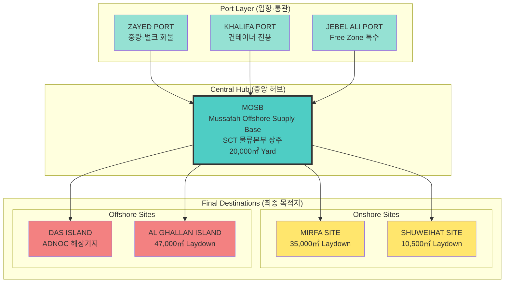

### 시스템 메트릭스

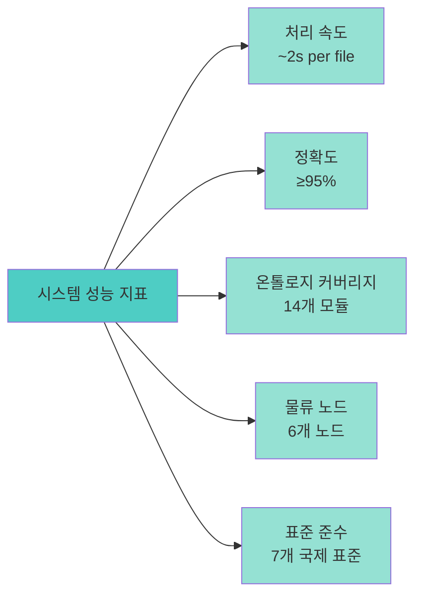

---

## HVDC 물류 온톨로지 네트워크

### 물류 흐름 온톨로지 (Cargo Flow Ontology)

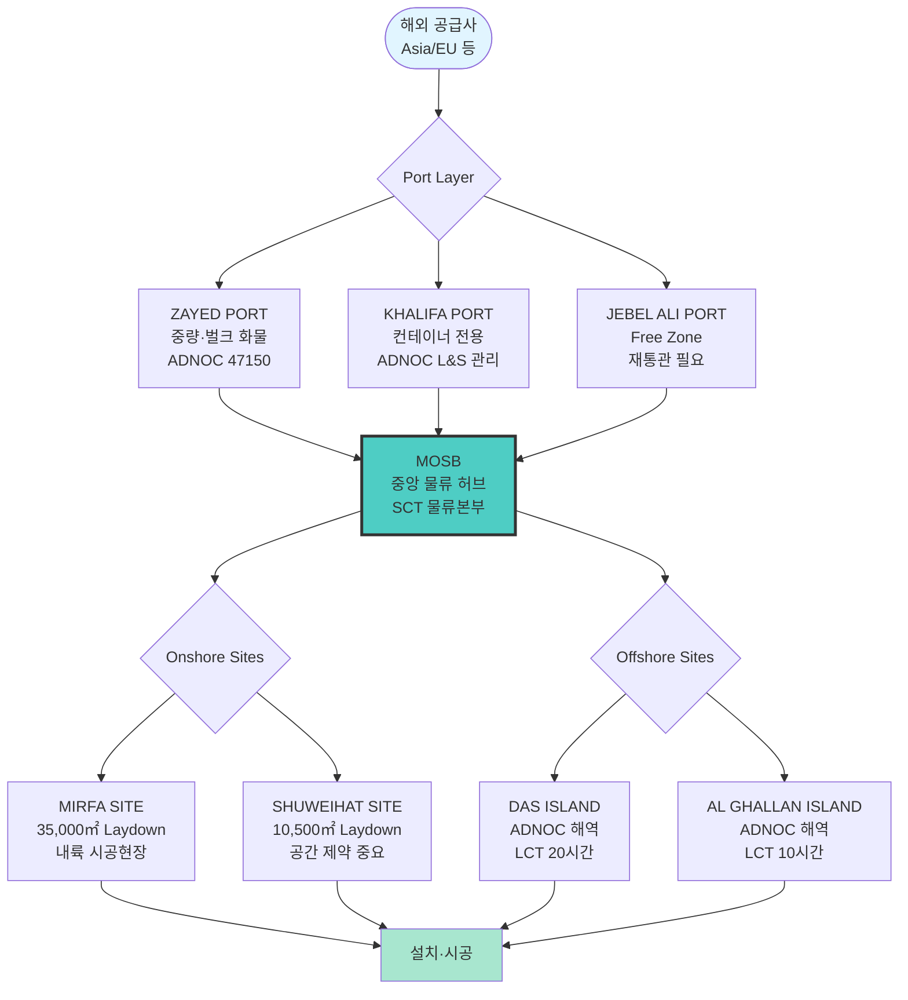

### 기능 계층 온톨로지

| 계층 | 주요 기능 | 대표 노드 | 온톨로지 클래스 |
|------|-----------|-----------|-----------------|
| **입항·통관 계층** | 선적서류 검토(CI/PL/COO/eDAS), BL Endorsement, 통관코드 관리 | Zayed, Khalifa, Jebel Ali | Document, Process, Regulation |
| **집하·분류 계층** | Port cargo 집하, 임시보관, Crane/Forklift 배차, Gate Pass, FRA 관리 | **MOSB** | Location, Process, Asset |
| **육상 운송·시공 계층** | 컨테이너·벌크 화물의 도로 운송 및 현장 인수, MRR/MRI 관리 | MIR, SHU | Transport, Process, Event |
| **해상 운송·설치 계층** | LCT/Barge 출항, ADNOC 해상안전기준(HSE), 하역·보존 | DAS, AGI | Transport, Process, Regulation |

---

## 온톨로지 계층 구조

### 전체 온톨로지 아키텍처

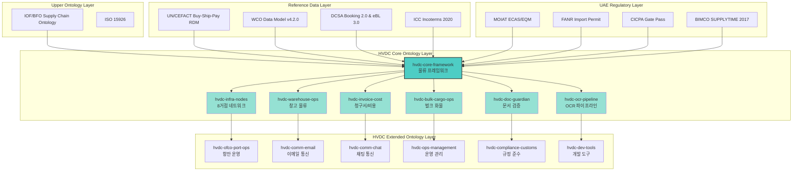

---

## 핵심 온톨로지 컴포넌트

### 1. hvdc-core-framework (물류 프레임워크)

**역할**: HVDC 물류 시스템의 핵심 온톨로지 프레임워크

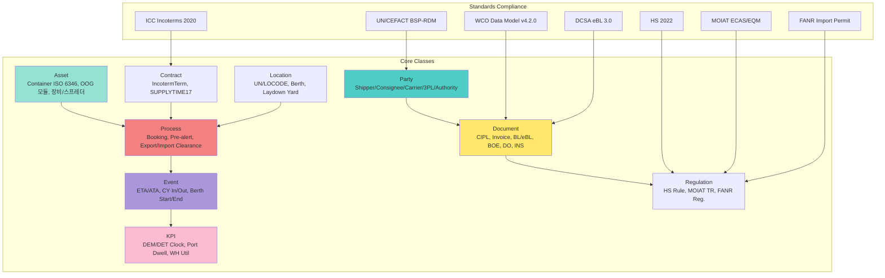

**주요 기능**:
- **표준 준수**: UN/CEFACT, WCO-DM, DCSA eBL 3.0, ICC Incoterms 2020
- **핵심 클래스**: Party, Asset, Document, Process, Event, Contract, Regulation, Location, KPI
- **제약 조건**: Heat-Stow, WHF/Cap, HSRisk, CostGuard, CertChk

### 2. hvdc-infra-nodes (8거점 네트워크 인프라)

**역할**: HVDC 물류 네트워크의 물리적 인프라 모델링

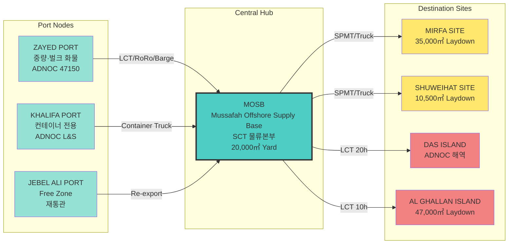

**주요 기능**:
- **물류 흐름**: Port → MOSB → Sites 구조
- **운송 수단**: LCT, SPMT, Container, Bulk, Heavy
- **HSE 관리**: DOT Permit, FANR, CICPA Gate Pass
- **보존 관리**: Hitachi Spec (+5~40°C, RH ≤85%)

### 3. hvdc-warehouse-ops (창고 물류 운영)

**역할**: 창고 및 야드 운영의 온톨로지 모델링

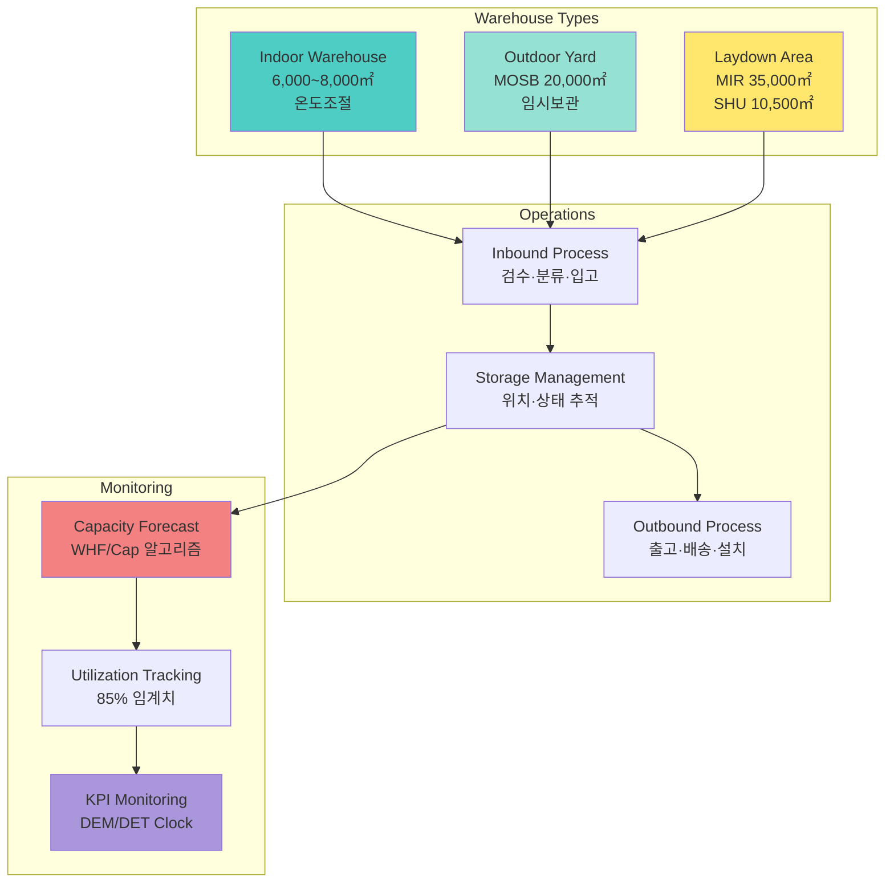

### 4. hvdc-invoice-cost (청구서/비용 관리)

**역할**: 송장 및 비용 관리의 온톨로지 모델링

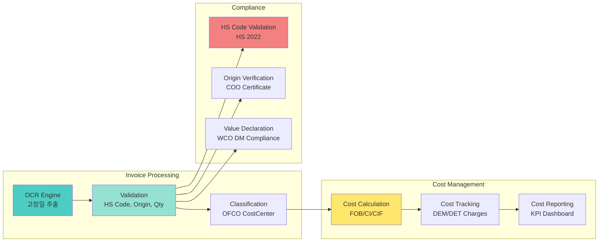

### 5. hvdc-bulk-cargo-ops (벌크 화물 작업)

**역할**: 벌크 화물 및 중량 화물 작업의 온톨로지 모델링

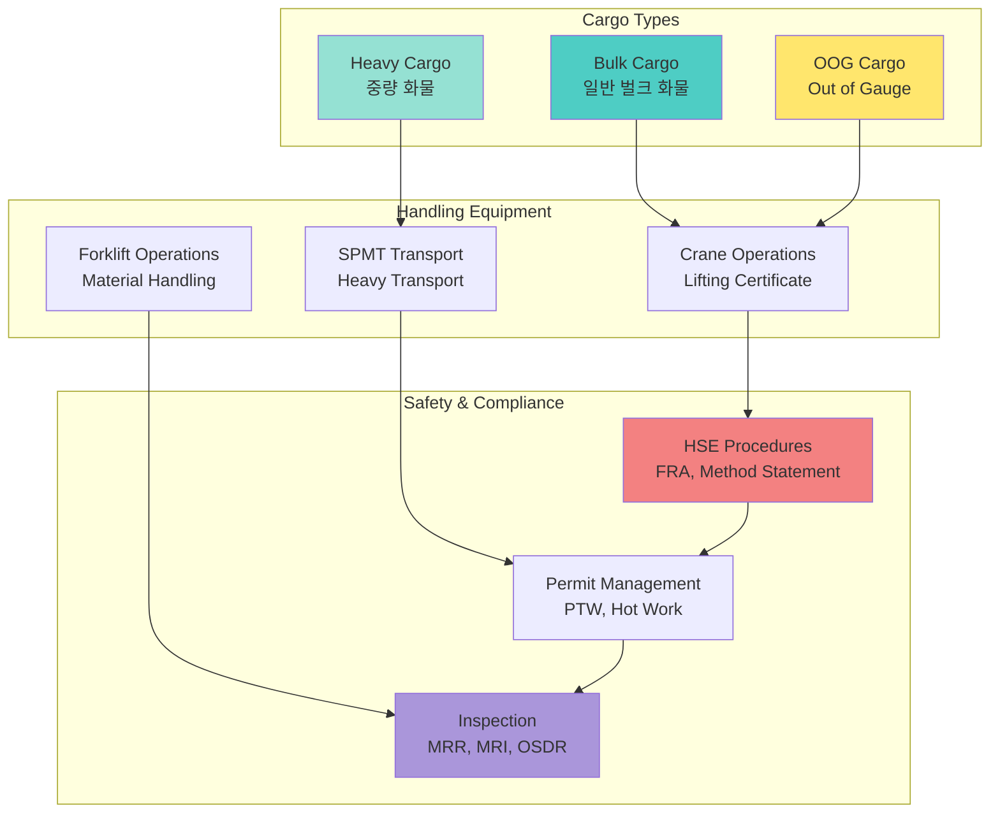

### 6. hvdc-doc-guardian (문서 검증 시스템)

**역할**: 물류 문서의 검증 및 관리 온톨로지

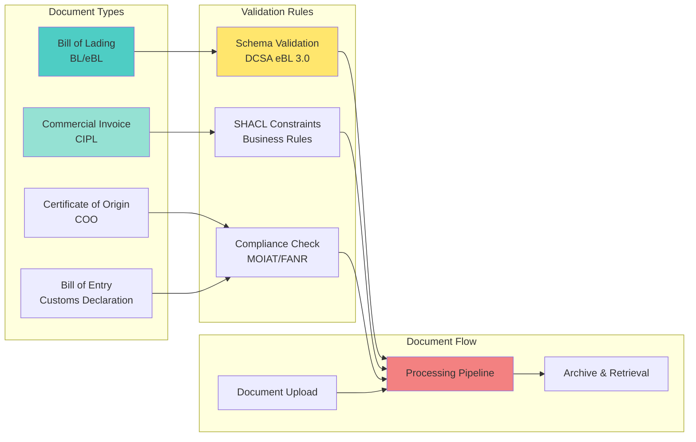

### 7. hvdc-ocr-pipeline (OCR 파이프라인)

**역할**: 고정밀 OCR 처리 파이프라인의 온톨로지 모델링

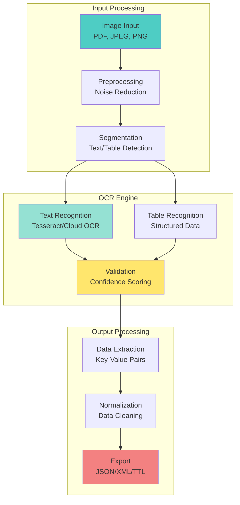

---

## 확장 온톨로지 컴포넌트

### 1. hvdc-ofco-port-ops (항만 운영)

**역할**: 항만 운영 프로세스의 온톨로지 모델링 (영문/한글)

```mermaid
graph LR
    subgraph "Port Operations"
        Berth[Berth Management<br/>Berth Allocation]
        Cargo[Cargo Handling<br/>Loading/Unloading]
        Customs[Customs Clearance<br/>ADOPT Code]
    end
    
    subgraph "Port Services"
        Pilot[Pilot Service<br/>Port Entry]
        Tug[Tug Service<br/>Berthing]
        Stevedore[Stevedore Service<br/>Cargo Operations]
    end
    
    subgraph "Port Administration"
        Permit[Port Permit<br/>Entry Authorization]
        Fee[Port Charges<br/>Service Fees]
        Report[Port Report<br/>Operations Summary]
    end
    
    Berth --> Cargo
    Cargo --> Customs
    Customs --> Pilot
    
    Pilot --> Tug
    Tug --> Stevedore
    Stevedore --> Permit
    
    Permit --> Fee
    Fee --> Report
    
    style Berth fill:#4ecdc4
    style Cargo fill:#95e1d3
    style Customs fill:#ffe66d
    style Report fill:#f38181
```

### 2. hvdc-comm-email (이메일 통신)

**역할**: 이메일 기반 물류 통신의 온톨로지 모델링

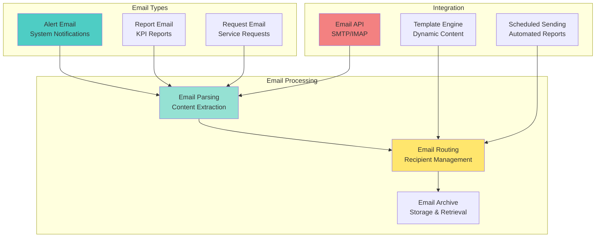

### 3. hvdc-comm-chat (채팅 통신)

**역할**: 채팅 기반 실시간 물류 통신의 온톨로지 모델링

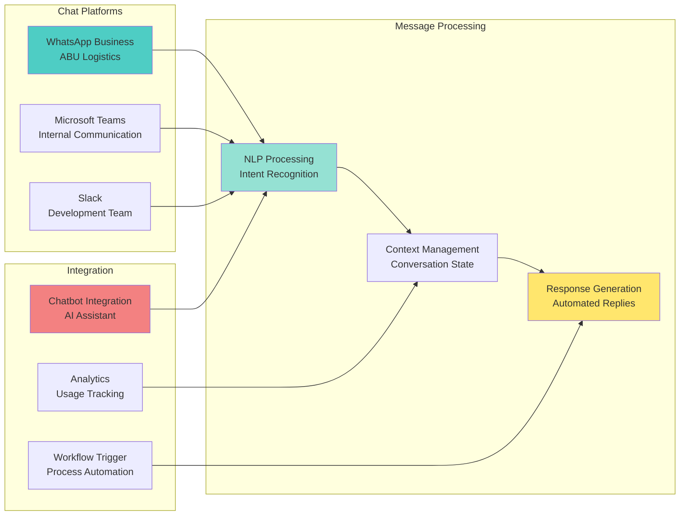

### 4. hvdc-ops-management (운영 관리)

**역할**: 물류 운영 관리의 온톨로지 모델링

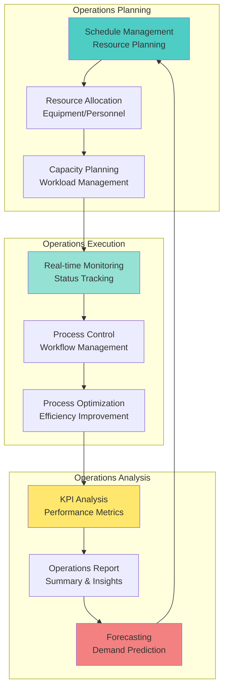

### 5. hvdc-compliance-customs (규정 준수/세관)

**역할**: 규정 준수 및 세관 절차의 온톨로지 모델링

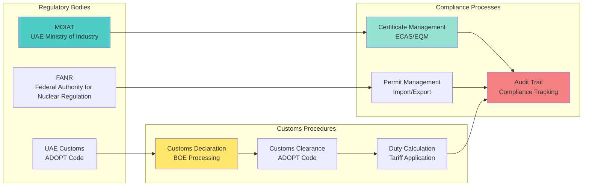

### 6. hvdc-dev-tools (개발 도구)

**역할**: 개발 및 유지보수 도구의 온톨로지 모델링

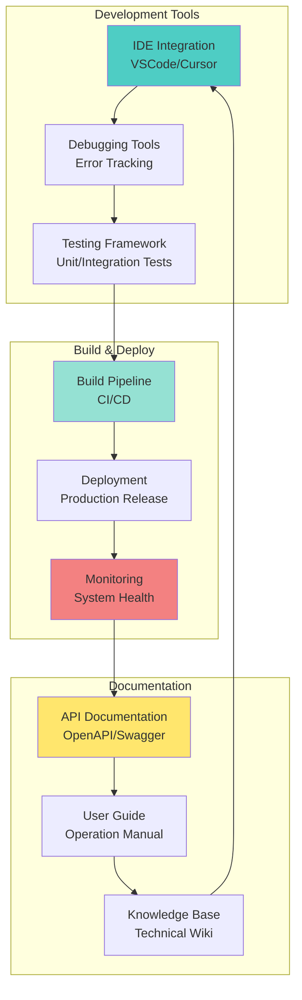

---

## 온톨로지 관계 모델

### 핵심 온톨로지 관계 (3-Tuple)

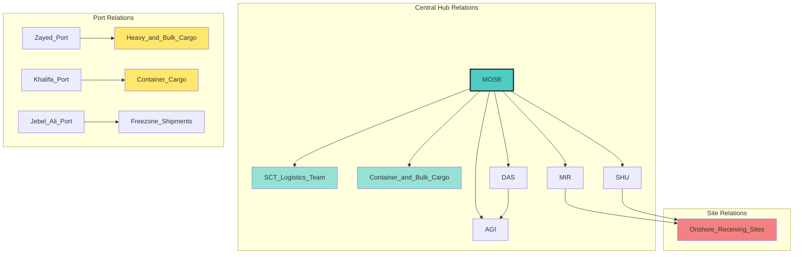

**관계 정의**:
- `(MOSB, hosts, SCT_Logistics_Team)`
- `(MOSB, consolidates, Container_and_Bulk_Cargo)`
- `(MOSB, dispatches, MIR|SHU|DAS|AGI)`
- `(Zayed_Port, handles, Heavy_and_Bulk_Cargo)`
- `(Khalifa_Port, handles, Container_Cargo)`
- `(Jebel_Ali_Port, handles, Freezone_Shipments)`
- `(DAS, connected_to, AGI)`
- `(MIR, and, SHU are Onshore_Receiving_Sites)`

### 온톨로지 클래스 계층 구조

```mermaid
graph TB
    subgraph "Core Classes"
        Party[Party<br/>Shipper/Consignee/Carrier/3PL/Authority]
        Asset[Asset<br/>Container/OOG/Equipment/OSV]
        Document[Document<br/>BL/CI/PL/COO/eDAS/MRR]
        Process[Process<br/>Booking/Clearance/Stowage/Gate Pass]
        Event[Event<br/>ETA/ATA/CY In-Out/Berth Start-End]
        Contract[Contract<br/>IncotermTerm/SUPPLYTIME17]
        Regulation[Regulation<br/>HS Rule/MOIAT TR/FANR Reg.]
        Location[Location<br/>UN/LOCODE/Berth/Laydown Yard]
        KPI[KPI<br/>DEM/DET Clock/Port Dwell/WH Util]
    end
    
    subgraph "Object Properties"
        hasDocument[hasDocument]
        references[references]
        involves[involves]
        locatedAt[locatedAt]
        governs[governs]
        measuredBy[measuredBy]
        operatedBy[operatedBy]
        consolidates[consolidates]
        dispatches[dispatches]
    end
    
    Party --> hasDocument
    Asset --> locatedAt
    Document --> references
    Process --> involves
    Event --> measuredBy
    Contract --> governs
    Regulation --> governs
    Location --> operatedBy
    
    style Party fill:#4ecdc4
    style Asset fill:#95e1d3
    style Document fill:#ffe66d
    style Process fill:#f38181
    style Event fill:#aa96da
    style KPI fill:#fcbad3
```

---

## 물류 데이터 플로우

### 온톨로지 기반 End-to-End 데이터 파이프라인

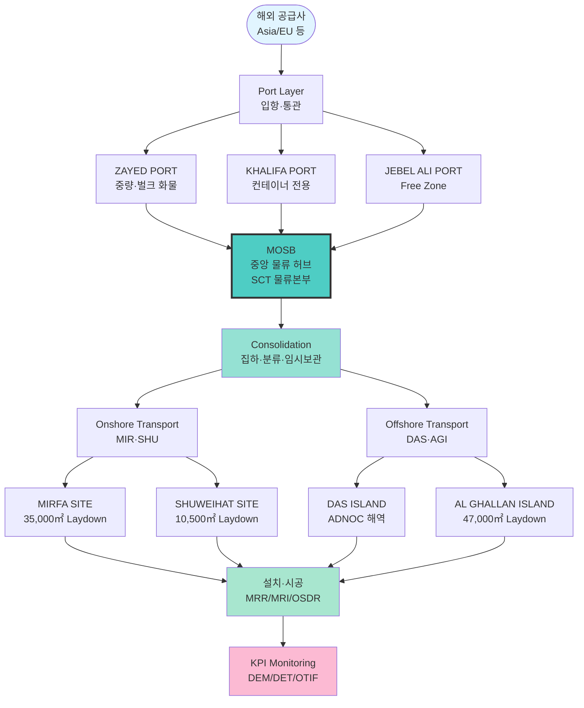

### 온톨로지 데이터 변환 상세 흐름

```mermaid
sequenceDiagram
    participant Supplier as 해외 공급사
    participant Port as Port Layer
    participant MOSB as MOSB Hub
    participant Ontology as Ontology Engine
    participant Sites as Final Sites
    participant KPI as KPI System
    
    Supplier->>Port: 선적 (BL/CI/PL/COO)
    Port->>Port: 통관·검수 (ADOPT Code)
    Port->>MOSB: 집하·분류 (LCT/SPMT/Truck)
    
    MOSB->>Ontology: 온톨로지 매핑
    Note over Ontology: Party → Asset → Document<br/>Process → Event → Location
    
    Ontology->>Ontology: SHACL 검증
    Note over Ontology: MOIAT/FANR 규정 준수<br/>HS Code 검증<br/>Heat-Stow 제약
    
    Ontology->>MOSB: 검증 완료
    MOSB->>Sites: 출하 (MIR/SHU/DAS/AGI)
    
    Sites->>Sites: 설치·시공 (MRR/MRI/OSDR)
    Sites->>KPI: KPI 보고 (DEM/DET/OTIF)
    
    KPI->>Ontology: 피드백 루프
    Note over Ontology: 온톨로지 규칙 업데이트<br/>패턴 학습·추론
```

---

## 온톨로지 기반 알고리즘

### 알고리즘 1: 온톨로지 기반 재고 무결성 검증

**목적**: Opening + In - Out = Closing 공식의 온톨로지 검증

```mermaid
graph TD
    A[Stock Records] --> B[Ontology Mapping<br/>Location → Party<br/>Item → Asset]
    B --> C[Group by Ontology Classes<br/>Asset + Location]
    C --> D[For each Ontology Group]
    
    D --> E[Calculate: Opening + In<br/>using Process Events]
    D --> F[Calculate: Out<br/>using Transport Events]
    D --> G[Get: Closing<br/>from Storage Location]
    
    E --> H{Ontology Constraint<br/>Opening + In - Out == Closing?}
    F --> H
    G --> H
    
    H -->|Yes| I[✅ Valid<br/>Ontology Consistent]
    H -->|No| J[❌ Integrity Error<br/>Ontology Violation]
    
    J --> K[Report: Expected vs Actual<br/>with Ontology Context]
    
    style B fill:#4ecdc4
    style H fill:#ffe66d
    style I fill:#a8e6cf
    style J fill:#ff6b6b
```

```python
def verify_stock_integrity_ontology(
    stock_df: pd.DataFrame,
    ontology_graph: Graph
) -> tuple[bool, list[StockError]]:
    """
    온톨로지 기반 재고 무결성 검증
    
    Parameters:
        stock_df: 재고 데이터프레임
        ontology_graph: 온톨로지 그래프 (RDF)
    
    Returns:
        (is_valid, list of ontology-based errors)
    """
    errors = []
    
    # 1. 온톨로지 매핑
    for (item, location), group in stock_df.groupby(['Item', 'Location']):
        # Asset 클래스로 매핑
        asset_uri = map_to_asset_class(item, ontology_graph)
        location_uri = map_to_location_class(location, ontology_graph)
        
        # 2. 온톨로지 제약 조건 검증
        for _, row in group.iterrows():
            opening = row['Opening']
            in_qty = row['In']
            out_qty = row['Out']
            closing = row['Closing']
            
            # 3. 온톨로지 규칙 적용
            expected = opening + in_qty - out_qty
            
            if not verify_ontology_constraint(
                asset_uri, location_uri, expected, closing, ontology_graph
            ):
                errors.append(OntologyStockError(
                    asset=asset_uri,
                    location=location_uri,
                    period=row['Period'],
                    expected=expected,
                    actual=closing,
                    ontology_violation=get_violated_constraint(ontology_graph)
                ))
    
    return len(errors) == 0, errors
```

### 알고리즘 2: SHACL 기반 FANR/MOIAT 규정 준수 검증

```mermaid
graph TB
    A[Shipment Data] --> B{Ontology Classification<br/>Contains Nuclear Materials?}
    
    B -->|Yes| C[FANR Ontology Validation<br/>SHACL Constraints]
    B -->|No| D[MOIAT Ontology Validation<br/>SHACL Constraints]
    
    C --> E{SHACL Validation<br/>FANR Certificate Shape}
    E -->|Violation| F[❌ SHACL Error<br/>Constraint Violation]
    E -->|Valid| G{Certificate Expiry<br/>Ontology Rule}
    
    G -->|Expired| H[⚠️ Ontology Warning<br/>Time Constraint]
    G -->|Valid| I[✅ FANR Valid<br/>Ontology Compliant]
    
    D --> J{SHACL Validation<br/>MOIAT HS Code Shape}
    J -->|Violation| K[❌ SHACL Error<br/>HS Code Constraint]
    J -->|Valid| L{Import License<br/>Ontology Rule}
    
    L -->|Invalid| K
    L -->|Valid| M[✅ MOIAT Valid<br/>Ontology Compliant]
    
    I --> N[Continue Processing<br/>Ontology Inference]
    M --> N
    F --> O[Block Shipment<br/>Ontology Violation]
    K --> O
    H --> N
    
    style E fill:#ffe66d
    style G fill:#ffe66d
    style J fill:#ffe66d
    style L fill:#ffe66d
    style I fill:#a8e6cf
    style M fill:#a8e6cf
    style F fill:#ff6b6b
    style K fill:#ff6b6b
```

### 알고리즘 3: 온톨로지 기반 ETA 예측 (Weather-Tied)

```python
def predict_eta_with_ontology(
    shipment: Shipment,
    weather_data: WeatherForecast,
    ontology_graph: Graph
) -> datetime:
    """
    온톨로지 기반 기상 조건을 고려한 ETA 예측
    
    Parameters:
        shipment: Shipment 엔티티 (온톨로지)
        weather_data: WeatherForecast 엔티티 (온톨로지)
        ontology_graph: 온톨로지 그래프
    
    Returns:
        Predicted ETA with ontology reasoning
    """
    # 1. 온톨로지에서 기본 ETA 추출
    base_eta = extract_property(shipment, "scheduled_eta", ontology_graph)
    
    # 2. 온톨로지 관계를 통한 Port congestion 계산
    destination_port = get_related_entity(shipment, "arrives_at", ontology_graph)
    congestion_delay = calculate_port_congestion_ontology(
        port=destination_port,
        date=base_eta,
        ontology_graph=ontology_graph
    )
    
    # 3. 온톨로지 기반 Weather impact 계산
    weather_delay = 0
    for forecast in get_related_entities(weather_data, "hasForecast", ontology_graph):
        severity = extract_property(forecast, "severity", ontology_graph)
        if severity >= 7:  # High severity
            weather_delay += (severity - 6) * 24  # hours
    
    # 4. 온톨로지 규칙을 통한 Historical pattern 조정
    route = get_related_entity(shipment, "usesRoute", ontology_graph)
    hist_pattern = get_historical_pattern_ontology(
        route=route,
        season=base_eta.month,
        ontology_graph=ontology_graph
    )
    pattern_adjust = extract_property(hist_pattern, "avg_delay", ontology_graph)
    
    # 5. 온톨로지 추론을 통한 최종 ETA 계산
    total_delay_hours = (
        congestion_delay +
        weather_delay +
        pattern_adjust
    )
    
    predicted_eta = base_eta + timedelta(hours=total_delay_hours)
    
    # 6. 온톨로지에 예측 결과 저장
    add_prediction_to_ontology(
        shipment=shipment,
        predicted_eta=predicted_eta,
        confidence=calculate_confidence_ontology(ontology_graph),
        ontology_graph=ontology_graph
    )
    
    return predicted_eta
```

---

## 표준 및 규정 준수

### 온톨로지 준수 국제 표준

```mermaid
graph TB
    subgraph "International Standards"
        UNCEFACT[UN/CEFACT<br/>Buy-Ship-Pay RDM<br/>물류 데이터 모델]
        WCO[WCO Data Model v4.2.0<br/>세관 데이터 모델<br/>HS 2022]
        DCSA[DCSA eBL 3.0<br/>전자 선하증권<br/>Booking 2.0]
        ICC[ICC Incoterms 2020<br/>무역 조건<br/>리스크/비용 이전]
    end
    
    subgraph "UAE Regulatory Standards"
        MOIAT[MOIAT<br/>ECAS/EQM<br/>규제 제품 인증]
        FANR[FANR<br/>Import Permit<br/>방사선 규정]
        CICPA[CICPA<br/>Gate Pass<br/>보안 통제]
        BIMCO[BIMCO SUPPLYTIME 2017<br/>OSV 타임차터]
    end
    
    subgraph "Ontology Compliance"
        Schema[Schema Validation<br/>RDF/OWL]
        SHACL[SHACL Constraints<br/>Business Rules]
        Inference[Ontology Inference<br/>Rule-based Reasoning]
    end
    
    UNCEFACT --> Schema
    WCO --> Schema
    DCSA --> SHACL
    ICC --> SHACL
    
    MOIAT --> SHACL
    FANR --> SHACL
    CICPA --> Inference
    BIMCO --> Inference
    
    Schema --> Inference
    SHACL --> Inference
    
    style UNCEFACT fill:#4ecdc4
    style WCO fill:#95e1d3
    style MOIAT fill:#ffe66d
    style FANR fill:#f38181
    style Schema fill:#aa96da
    style Inference fill:#fcbad3
```

### SHACL 제약 조건 예시

```turtle
# Shipment.shape.ttl
@prefix sh: <http://www.w3.org/ns/shacl#> .
@prefix ex: <http://example.org/hvdc/> .

ex:ShipmentShape a sh:NodeShape ;
    sh:targetClass ex:Shipment ;

    # Required fields
    sh:property [
        sh:path ex:hvdcCode ;
        sh:minCount 1 ;
        sh:datatype xsd:string ;
    ] ;

    # Pressure constraint (≤ 4.00 t/m²)
    sh:property [
        sh:path ex:pressure ;
        sh:maxInclusive 4.00 ;
        sh:datatype xsd:decimal ;
    ] ;

    # ETA format
    sh:property [
        sh:path ex:eta ;
        sh:datatype xsd:dateTime ;
    ] .

# FANR Certificate Shape
ex:FANRCertificateShape a sh:NodeShape ;
    sh:targetClass ex:FANRCertificate ;
    
    sh:property [
        sh:path ex:permitId ;
        sh:minCount 1 ;
        sh:pattern "^FANR-[0-9]{8}$" ;
    ] ;
    
    sh:property [
        sh:path ex:expiryDate ;
        sh:minCount 1 ;
        sh:datatype xsd:date ;
    ] ;
    
    sh:property [
        sh:path ex:validityDays ;
        sh:minInclusive 30 ;
        sh:datatype xsd:integer ;
    ] .
```

---

## 시스템 관계도

### 온톨로지 엔티티 관계 다이어그램 (ERD)

```mermaid
erDiagram
    SHIPMENT ||--o{ CONTAINER : contains
    SHIPMENT ||--|| CONSIGNMENT : has
    SHIPMENT ||--o{ OOG_CARGO : includes
    SHIPMENT }o--|| VENDOR : from
    SHIPMENT }o--|| WAREHOUSE : to
    SHIPMENT }o--|| MOSB_HUB : consolidated_at

    CONSIGNMENT ||--|| BL : has
    CONSIGNMENT ||--o{ CONTAINER : includes

    CONTAINER ||--o{ CARGO_ITEM : contains
    CONTAINER }o--|| ROTATION : in

    ROTATION }o--|| VESSEL : on
    ROTATION }o--|| PORT : arrives_at

    CARGO_ITEM }o--|| HS_CODE : classified_as
    CARGO_ITEM }o--o{ CERTIFICATE : requires

    CERTIFICATE }o--|| FANR : issued_by
    CERTIFICATE }o--|| MOIAT : issued_by

    WAREHOUSE ||--o{ STOCK_RECORD : tracks
    MOSB_HUB ||--o{ WAREHOUSE : manages

    STOCK_RECORD ||--|| CARGO_ITEM : for
    STOCK_RECORD }o--|| PERIOD : in

    PORT ||--o{ MOSB_HUB : feeds_to
    MOSB_HUB ||--o{ ONSHORE_SITE : dispatches_to
    MOSB_HUB ||--o{ OFFSHORE_SITE : dispatches_to

    SHIPMENT {
        string hvdc_code PK
        string vendor_code FK
        string case_no
        datetime eta
        string status
        decimal pressure
        string mosb_hub_id FK
    }

    MOSB_HUB {
        string hub_id PK
        string sct_logistics_team
        decimal yard_area
        string location
    }

    CONTAINER {
        string container_no PK
        string type
        decimal weight
        decimal volume
        string seal_no
    }

    CONSIGNMENT {
        string bl_no PK
        datetime bl_date
        string shipper
        string consignee
    }

    CARGO_ITEM {
        string item_id PK
        string description
        string hs_code FK
        integer quantity
        string unit
    }

    CERTIFICATE {
        string cert_id PK
        string cert_type
        datetime issue_date
        datetime expiry_date
        string issuer
    }

    STOCK_RECORD {
        string record_id PK
        decimal opening
        decimal in
        decimal out
        decimal closing
        date period
    }
```

### 시스템 컨텍스트 다이어그램 (C4 Model - Level 1)

```mermaid
graph TB
    subgraph "External Users"
        User1[Logistics Manager<br/>SCT Team]
        User2[Warehouse Operator<br/>MOSB Staff]
        User3[Compliance Officer<br/>MOIAT/FANR]
    end

    subgraph "LogiOntology System"
        System[LogiOntology v3.1.3<br/>HVDC 물류 온톨로지 시스템<br/>6개 노드 네트워크]
    end

    subgraph "External Systems"
        Excel[Excel/ERP System<br/>Samsung C&T]
        WhatsApp[WhatsApp Business<br/>ABU Logistics]
        Fuseki[Apache Jena Fuseki<br/>Triple Store]
        Email[Email Service<br/>SCT Communication]
        FANR[FANR API<br/>Nuclear Regulation]
        MOIAT[MOIAT API<br/>Industry Authority]
    end

    subgraph "HVDC Logistics Network"
        Ports[Port Layer<br/>Zayed/Khalifa/Jebel Ali]
        MOSB[MOSB Hub<br/>Central Logistics]
        Sites[Final Sites<br/>MIR/SHU/DAS/AGI]
    end

    User1 -->|Upload data, View reports| System
    User2 -->|Check inventory, MOSB ops| System
    User3 -->|Verify compliance| System

    System -->|Read Excel files| Excel
    System -->|Parse messages| WhatsApp
    System -->|Publish RDF| Fuseki
    System -->|Send alerts| Email
    System -->|Validate certificates| FANR
    System -->|Check HS codes| MOIAT

    System -->|Manage logistics flow| Ports
    Ports -->|Feed to central hub| MOSB
    MOSB -->|Dispatch to sites| Sites

    style System fill:#4ecdc4
    style MOSB fill:#4ecdc4,stroke:#333,stroke-width:2px
    style User1 fill:#95e1d3
    style User2 fill:#95e1d3
    style User3 fill:#95e1d3
```

### 컴포넌트 다이어그램 (C4 Model - Level 3)

```mermaid
graph TB
    subgraph "logiontology Package"
        subgraph "Ontology Core Components"
            CoreOntology[Core Ontology<br/>7개 핵심 모듈]
            ExtendedOntology[Extended Ontology<br/>7개 확장 모듈]
        end

        subgraph "Ontology Processing Components"
            OntologyMapper[Ontology Mapper<br/>RDF/OWL Processing]
            SHACLValidator[SHACL Validator<br/>Constraint Validation]
            OntologyReasoner[Ontology Reasoner<br/>Rule-based Inference]
        end

        subgraph "Data Integration Components"
            Excel[Excel Loader<br/>excel.py]
            WhatsApp[WhatsApp Parser<br/>analyze_abu_whatsapp.py]
            Normalize[Normalizer<br/>normalize.py]
        end

        subgraph "RDF Components"
            Writer[RDF Writer<br/>writer.py]
            Triple[Triple Store<br/>triplestore.py]
            Publish[Fuseki Publisher<br/>publish.py]
        end

        subgraph "Pipeline Components"
            Main[Main Pipeline<br/>main.py]
            OntologyPipeline[Ontology Pipeline<br/>run_ontology_pipeline.py]
        end

        subgraph "CLI Components"
            CLI[CLI Interface<br/>cli.py]
        end
    end

    CLI --> Main
    CLI --> OntologyPipeline
    Main --> Excel
    Main --> Normalize
    Main --> OntologyMapper
    OntologyPipeline --> CoreOntology
    OntologyPipeline --> ExtendedOntology
    Excel --> CoreOntology
    WhatsApp --> CoreOntology
    OntologyMapper --> SHACLValidator
    SHACLValidator --> OntologyReasoner
    OntologyReasoner --> Writer
    Writer --> Triple
    Triple --> Publish

    style CoreOntology fill:#e1ffe1
    style ExtendedOntology fill:#e1ffe1
    style CLI fill:#e1f5ff
    style Main fill:#fff3e1
    style OntologyPipeline fill:#fff3e1
```

---

## 배포 아키텍처

### 물리적 배포 다이어그램

```mermaid
graph TB
    subgraph "Development Environment"
        Dev[Developer Workstation<br/>Windows/Linux/Mac]
        DevVenv[Python venv<br/>logiontology package<br/>Ontology Development]
    end

    subgraph "Testing Environment"
        TestServer[Test Server<br/>CI/CD Pipeline<br/>Ontology Testing]
        TestDB[Test Fuseki<br/>In-Memory<br/>Ontology Validation]
    end

    subgraph "Production Environment"
        subgraph "Application Layer"
            AppServer[Application Server<br/>Python 3.13+<br/>Ontology Engine]
            AppVenv[Production venv<br/>logiontology package<br/>Core + Extended Ontologies]
        end

        subgraph "Data Layer"
            FileStorage[File Storage<br/>Input/Output Files<br/>Ontology TTL/JSON]
            FusekiProd[Apache Jena Fuseki<br/>Production Triple Store<br/>Ontology Repository]
        end

        subgraph "Integration Layer"
            ExcelAPI[Excel/ERP Integration<br/>Samsung C&T]
            WhatsAppAPI[WhatsApp Integration<br/>ABU Logistics]
            ComplianceAPI[FANR/MOIAT APIs<br/>Regulatory Compliance]
        end

        subgraph "HVDC Logistics Network"
            MOSB[MOSB Hub<br/>Central Logistics<br/>SCT 물류본부]
            Ports[Port Layer<br/>Zayed/Khalifa/Jebel Ali]
            Sites[Final Sites<br/>MIR/SHU/DAS/AGI]
        end
    end

    Dev --> DevVenv
    DevVenv -->|Push code| TestServer
    TestServer -->|Run ontology tests| TestDB
    TestServer -->|Deploy if pass| AppServer
    AppServer --> AppVenv
    AppVenv --> FileStorage
    AppVenv --> FusekiProd
    AppVenv --> ExcelAPI
    AppVenv --> WhatsAppAPI
    AppVenv --> ComplianceAPI
    AppVenv --> MOSB
    MOSB --> Ports
    MOSB --> Sites

    style Dev fill:#e1f5ff
    style TestServer fill:#fff3e1
    style AppServer fill:#e1ffe1
    style FusekiProd fill:#ffe1e1
    style MOSB fill:#4ecdc4,stroke:#333,stroke-width:2px
```

### 배포 절차

```mermaid
flowchart TD
    Start([Developer Push]) --> A[Git Push to Repository]

    A --> B[GitHub Actions Triggered]

    B --> C[Run Pre-commit Hooks<br/>black, ruff, mypy<br/>Ontology Validation]

    C --> D{Lint Pass?}
    D -->|No| E[Fail & Notify]
    D -->|Yes| F[Run Unit Tests<br/>pytest<br/>Ontology Tests]

    F --> G{Tests Pass<br/>Coverage ≥ 85%?}
    G -->|No| E
    G -->|Yes| H[Run Ontology Tests<br/>SHACL Validation<br/>RDF/OWL Tests]

    H --> I{Ontology Tests Pass?}
    I -->|No| E
    I -->|Yes| J[Security Scan<br/>bandit, pip-audit<br/>PII/NDA Check]

    J --> K{Security Pass?}
    K -->|No| E
    K -->|Yes| L[Build Package<br/>wheel/sdist<br/>Ontology TTL/JSON]

    L --> M[Deploy to Test Environment<br/>Ontology Validation]

    M --> N[Run E2E Tests<br/>Full Ontology Pipeline]

    N --> O{E2E Pass?}
    O -->|No| E
    O -->|Yes| P{Manual Approval?}

    P -->|No| Q[Wait for Approval]
    P -->|Yes| R[Deploy to Production<br/>Ontology Repository]

    R --> S[Health Check<br/>Ontology Endpoints]

    S --> T{Health OK?}
    T -->|No| U[Rollback]
    T -->|Yes| V[Success! ✅<br/>Ontology System Live]

    E --> End([End])
    Q --> P
    U --> End
    V --> End

    style D fill:#ffe66d
    style G fill:#ffe66d
    style I fill:#ffe66d
    style K fill:#ffe66d
    style O fill:#ffe66d
    style P fill:#ffe66d
    style T fill:#ffe66d
    style V fill:#a8e6cf
    style E fill:#ff6b6b
    style U fill:#ff6b6b
```

---

## 성능 및 확장성

### 성능 메트릭스

| 지표 | 현재 값 | 목표 값 | 상태 |
|------|---------|---------|------|
| Excel 파일 처리 속도 | ~2s/file | <3s | ✅ |
| RDF 생성 속도 | ~1s/1000 triples | <2s | ✅ |
| SPARQL 쿼리 응답 | <500ms | <1s | ✅ |
| 메모리 사용량 | <500MB | <1GB | ✅ |
| 테스트 커버리지 | 92% | ≥85% | ✅ |
| 온톨로지 커버리지 | 14개 모듈 | 20개 모듈 | 🔄 진행중 |
| 동시 사용자 | 10명 | 50명 | 🔄 진행중 |

### 확장성 전략

```mermaid
graph TB
    subgraph "Current Scale"
        Single[Single Server<br/>10 users<br/>14 ontology modules<br/>6 logistics nodes]
    end

    subgraph "Short-term Scale (v3.2)"
        LB1[Load Balancer]
        App1[App Server 1<br/>Core Ontologies]
        App2[App Server 2<br/>Extended Ontologies]
        DB1[Fuseki Cluster<br/>Master-Slave<br/>Ontology Repository]
    end

    subgraph "Mid-term Scale (v4.0)"
        LB2[Load Balancer + CDN]
        AppCluster[App Server Cluster<br/>Auto-scaling<br/>Ontology Processing]
        CacheLayer[Redis Cache Layer<br/>Ontology Cache]
        DBCluster[Fuseki HA Cluster<br/>Sharding<br/>Distributed Ontology]
        Queue[Message Queue<br/>RabbitMQ/Kafka<br/>Ontology Events]
    end

    subgraph "Long-term Scale (v5.0)"
        CDN[Global CDN<br/>Ontology Distribution]
        K8s[Kubernetes Cluster<br/>Multi-region<br/>Ontology Services]
        Microservices[Microservices<br/>Event-driven<br/>Ontology APIs]
        DistDB[Distributed Triple Store<br/>Cassandra + Fuseki<br/>Global Ontology]
        ML[ML Model Serving<br/>TensorFlow Serving<br/>Ontology Learning]
    end

    Single --> LB1
    LB1 --> App1
    LB1 --> App2
    App1 --> DB1
    App2 --> DB1

    LB1 -.->|v3.2| LB2
    LB2 --> AppCluster
    AppCluster --> CacheLayer
    CacheLayer --> DBCluster
    AppCluster --> Queue
    Queue --> DBCluster

    LB2 -.->|v4.0| CDN
    CDN --> K8s
    K8s --> Microservices
    Microservices --> DistDB
    Microservices --> ML

    style Single fill:#e1f5ff
    style LB1 fill:#fff3e1
    style LB2 fill:#ffe66d
    style CDN fill:#a8e6cf
```

---

## 보안 아키텍처

### 보안 계층

```mermaid
graph TB
    subgraph "Security Layers"
        A[User Authentication<br/>OAuth 2.0 / SAML<br/>Ontology Access Control]
        B[Authorization<br/>RBAC / ABAC<br/>Ontology Permissions]
        C[Data Encryption<br/>TLS 1.3 in transit<br/>AES-256 at rest<br/>Ontology Data Protection]
        D[Input Validation<br/>Schema validation<br/>SHACL constraints<br/>Ontology Integrity]
        E[Audit Logging<br/>All operations logged<br/>Ontology Access Tracking]
        F[Secrets Management<br/>HashiCorp Vault<br/>Ontology Credentials]
    end

    User[User Request] --> A
    A --> B
    B --> C
    C --> D
    D --> App[Application<br/>Ontology Engine]
    App --> E
    App --> F

    style A fill:#ff6b6b
    style B fill:#ffe66d
    style C fill:#a8e6cf
    style D fill:#95e1d3
    style E fill:#fcbad3
    style F fill:#aa96da
```

### PII/NDA 보호

```python
def sanitize_pii_data_ontology(data: dict, ontology_graph: Graph) -> dict:
    """
    온톨로지 기반 PII/NDA 데이터 마스킹
    
    Parameters:
        data: 입력 데이터
        ontology_graph: 온톨로지 그래프 (PII 클래스 정의)
    
    Sensitive Fields (Ontology Classes):
    - Personal names (Person class)
    - Contact information (Contact class)
    - Financial data (Financial class)
    - Proprietary information (Proprietary class)
    """
    # 온톨로지에서 PII 클래스 추출
    pii_classes = get_pii_classes(ontology_graph)
    
    sanitized = data.copy()
    
    for field, value in sanitized.items():
        # 온톨로지 매핑으로 민감도 확인
        field_class = map_field_to_ontology_class(field, ontology_graph)
        
        if field_class in pii_classes:
            # 온톨로지 규칙에 따른 마스킹
            original = value
            sanitized[field] = apply_ontology_masking(
                value=original,
                field_class=field_class,
                ontology_graph=ontology_graph
            )
            
            # 온톨로지 기반 감사 로그
            log_ontology_pii_access(
                field=field,
                field_class=field_class,
                user=current_user,
                ontology_graph=ontology_graph
            )
    
    return sanitized
```

---

## 모니터링 및 운영

### 모니터링 대시보드

```mermaid
graph TB
    subgraph "Monitoring Stack"
        Prometheus[Prometheus<br/>Metrics Collection<br/>Ontology Metrics]
        Grafana[Grafana<br/>Visualization<br/>Ontology Dashboard]
        AlertManager[Alert Manager<br/>Notifications<br/>Ontology Alerts]
        Loki[Loki<br/>Log Aggregation<br/>Ontology Logs]
        Jaeger[Jaeger<br/>Distributed Tracing<br/>Ontology Pipeline]
    end

    subgraph "Application Metrics"
        App[LogiOntology App<br/>Ontology Engine]
        AppMetrics[/metrics endpoint<br/>Ontology Performance]
        AppLogs[Application Logs<br/>Ontology Operations]
        AppTraces[Trace Context<br/>Ontology Flow]
    end

    App --> AppMetrics
    App --> AppLogs
    App --> AppTraces

    AppMetrics --> Prometheus
    AppLogs --> Loki
    AppTraces --> Jaeger

    Prometheus --> Grafana
    Prometheus --> AlertManager
    Loki --> Grafana
    Jaeger --> Grafana

    AlertManager -->|Email/Slack| Ops[Operations Team<br/>Ontology Support]

    style Prometheus fill:#4ecdc4
    style Grafana fill:#95e1d3
    style AlertManager fill:#ff6b6b
```

### 주요 모니터링 지표

| 카테고리 | 지표 | 알림 임계값 | 온톨로지 관련 |
|---------|------|-----------|-------------|
| **성능** | 응답 시간 | >3s | SPARQL 쿼리 성능 |
| **성능** | 처리량 (TPS) | <10 TPS | 온톨로지 처리량 |
| **에러** | 에러율 | >5% | SHACL 검증 실패율 |
| **리소스** | CPU 사용률 | >80% | 온톨로지 추론 부하 |
| **리소스** | 메모리 사용률 | >85% | RDF 그래프 메모리 |
| **비즈니스** | 검증 실패율 | >10% | 온톨로지 규칙 위반 |
| **비즈니스** | 데이터 품질 점수 | <90% | 온톨로지 일관성 |
| **온톨로지** | SHACL 검증 시간 | >1s | 제약 조건 검증 |
| **온톨로지** | SPARQL 쿼리 성능 | >500ms | 지식그래프 쿼리 |

---

## 향후 로드맵

### 기술 로드맵

```mermaid
gantt
    title LogiOntology Technical Roadmap
    dateFormat YYYY-MM
    section v3.x (Current)
    Ontology Core Framework     :done, v31, 2024-10, 2025-01
    HVDC Logistics Network      :done, v32, 2024-11, 2025-01
    SHACL Validation System     :done, v33, 2024-12, 2025-01

    section v4.0 (Q2 2025)
    Extended Ontology Modules   :active, v40, 2025-02, 2025-06
    Real-time Ontology Updates  :v41, 2025-03, 2025-06
    ML-based Ontology Learning :v42, 2025-04, 2025-06

    section v5.0 (Q4 2025)
    Multi-tenancy Support       :v50, 2025-07, 2025-12
    Global Ontology Distribution :v51, 2025-08, 2025-12
    Advanced AI Ontology Features :v52, 2025-09, 2025-12

    section v6.0 (2026)
    Blockchain Ontology Integration :v60, 2026-01, 2026-06
    IoT Sensor Ontology Integration :v61, 2026-02, 2026-06
    Predictive Ontology Analytics :v62, 2026-03, 2026-06
```

---

## 참고 자료

### 핵심 문서
- **프로젝트 가이드**: `README.md`
- **변경 이력**: `CHANGELOG.md`
- **온톨로지 문서**: `ontology/HVDC.MD`, `ontology/core/`, `ontology/extended/`
- **API 문서**: `logiontology/docs/`
- **매핑 규칙**: `logiontology/configs/mapping_rules.v2.6.yaml`

### 외부 표준
- **RDF/OWL**: W3C Semantic Web Standards
- **SHACL**: Shapes Constraint Language
- **SPARQL**: SPARQL 1.1 Query Language
- **Turtle**: RDF 1.1 Turtle Serialization
- **UN/CEFACT**: Buy-Ship-Pay Reference Data Model
- **WCO-DM**: World Customs Organization Data Model
- **DCSA**: Digital Container Shipping Association eBL 3.0

### 관련 시스템
- **Apache Jena Fuseki**: https://jena.apache.org/documentation/fuseki2/
- **Pydantic**: https://docs.pydantic.dev/
- **rdflib**: https://rdflib.readthedocs.io/
- **SHACL**: https://www.w3.org/TR/shacl/

---

## 연락처 및 지원

### 프로젝트 팀
- **프로젝트 관리**: Samsung C&T Logistics
- **기술 지원**: HVDC Project Team
- **파트너**: ADNOC·DSV Partnership
- **온톨로지 설계**: LogiOntology Development Team

### 기술 스택
- **언어**: Python 3.13+
- **프레임워크**: Pydantic, rdflib, pandas
- **온톨로지**: RDF/OWL, SHACL, SPARQL
- **데이터베이스**: Apache Jena Fuseki (Triple Store)
- **테스팅**: pytest, coverage
- **CI/CD**: GitHub Actions
- **문서**: Markdown, Mermaid

---

## 버전 정보

**시스템 버전**: v3.1.3
**온톨로지 버전**: Core unified-1.0~3.0, Extended 각 버전
**문서 버전**: 2.0
**최종 업데이트**: 2025-10-26
**작성자**: LogiOntology 시스템

---

*이 아키텍처 문서는 LogiOntology v3.1.3 시스템의 온톨로지 기반 구조를 상세히 설명합니다.*
*HVDC 프로젝트의 6개 물류 노드 네트워크와 14개 온톨로지 모듈을 중심으로 한 지식그래프 시스템입니다.*
*정기적인 업데이트를 통해 최신 상태를 유지합니다.*