HVDC Pipeline 시스템 아키텍처 문서 v4.0.54

**Samsung C&T Logistics | ADNOC·DSV Strategic Partnership**

## 📋 목차

1. [시스템 개요](#시스템-개요)
2. [전체 아키텍처](#전체-아키텍처)
3. [Core 모듈 아키텍처](#core-모듈-아키텍처)
4. [Stage별 상세 아키텍처](#stage별-상세-아키텍처)
5. [데이터 흐름](#데이터-흐름)
6. [컴포넌트 상호작용](#컴포넌트-상호작용)
7. [설정 및 구성](#설정-및-구성)
8. [확장성 및 유지보수성](#확장성-및-유지보수성)

---

## 시스템 개요

### 목적

HVDC Pipeline은 물류 데이터 처리 자동화 시스템으로, 원본 Excel 파일부터 종합 보고서 및 이상치 탐지까지 4단계 파이프라인을 제공합니다.

### 핵심 원칙

- **Single Source of Truth (SSOT)**: Core 모듈을 통한 중앙 집중식 관리
- **의미 기반 매칭**: 하드코딩 제거, 시맨틱 매칭으로 유연성 확보
- **모듈화**: 각 Stage는 독립적이면서도 Core 모듈을 통해 통합
- **확장성**: 새 벤더/헤더 추가 시 Registry만 수정

---

## 전체 아키텍처

### 시스템 레이어 구조

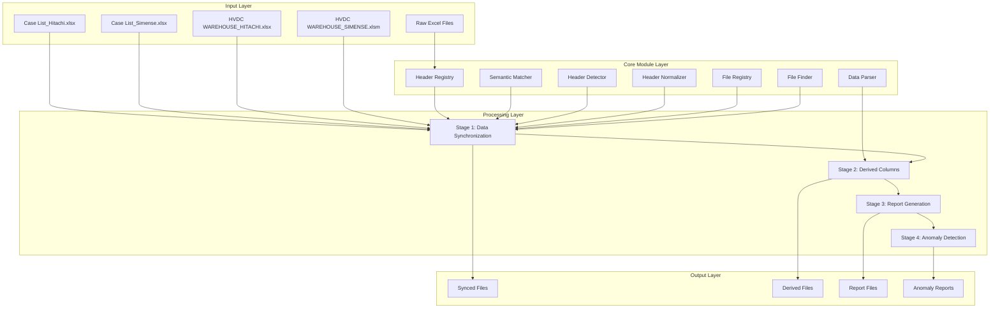

### 전체 파이프라인 흐름

```mermaid
flowchart TD
    Start([시작]) --> LoadConfig[설정 파일 로드]
    LoadConfig --> InitCore[Core 모듈 초기화]
    InitCore --> Stage1[Stage 1: 데이터 동기화]
  
    Stage1 --> S1_HeaderDetect[헤더 자동 탐지]
    S1_HeaderDetect --> S1_SemanticMatch[시맨틱 매칭]
    S1_SemanticMatch --> S1_Sync[Master-Warehouse 동기화]
    S1_Sync --> S1_Metadata[메타데이터 설정]
    S1_Metadata --> S1_Color[색상 표시]
    S1_Color --> Stage1Out[*.synced_v3.4.xlsx]
  
    Stage1Out --> Stage2[Stage 2: 파생 컬럼]
    Stage2 --> S2_Derived[13개 파생 컬럼 계산]
    S2_Derived --> S2_SQM[SQM 계산]
    S2_SQM --> S2_Stack[Stack_Status 파싱]
    S2_Stack --> S2_Split[벤더별 파일 분리]
    S2_Split --> Stage2Out[*.xlsx]
  
    Stage2Out --> Stage3[Stage 3: 보고서 생성]
    Stage3 --> S3_Flow[Flow Code 계산]
    S3_Flow --> S3_Monthly[월별 입출고 분석]
    S3_Monthly --> S3_Pivot[피벗 테이블 생성]
    S3_Pivot --> S3_Sheets[12개 시트 생성]
    S3_Sheets --> Stage3Out[종합리포트.xlsx]
  
    Stage3Out --> Stage4[Stage 4: 이상치 탐지]
    Stage4 --> S4_Balanced[Balanced Boost 분석]
    S4_Balanced --> S4_Rule[룰 기반 검증]
    S4_Rule --> S4_ML[ML 기반 탐지]
    S4_ML --> S4_Visualize[색상 시각화]
    S4_Visualize --> Stage4Out[anomaly_report.xlsx]
  
    Stage4Out --> End([완료])
  
    style Start fill:#90EE90
    style End fill:#FFB6C1
    style Stage1 fill:#87CEEB
    style Stage2 fill:#87CEEB
    style Stage3 fill:#87CEEB
    style Stage4 fill:#87CEEB
```

---

## Core 모듈 아키텍처

### Core 모듈 구조

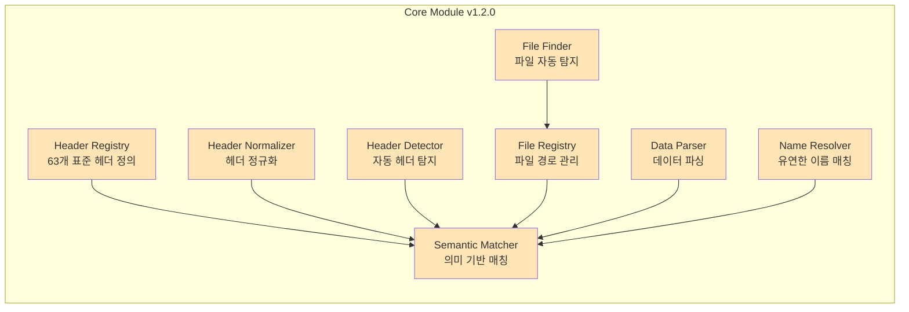

### Header Registry 구조

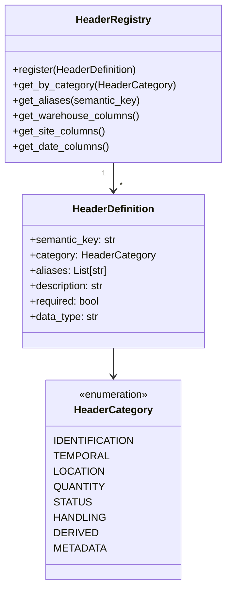

### Semantic Matcher 동작 원리

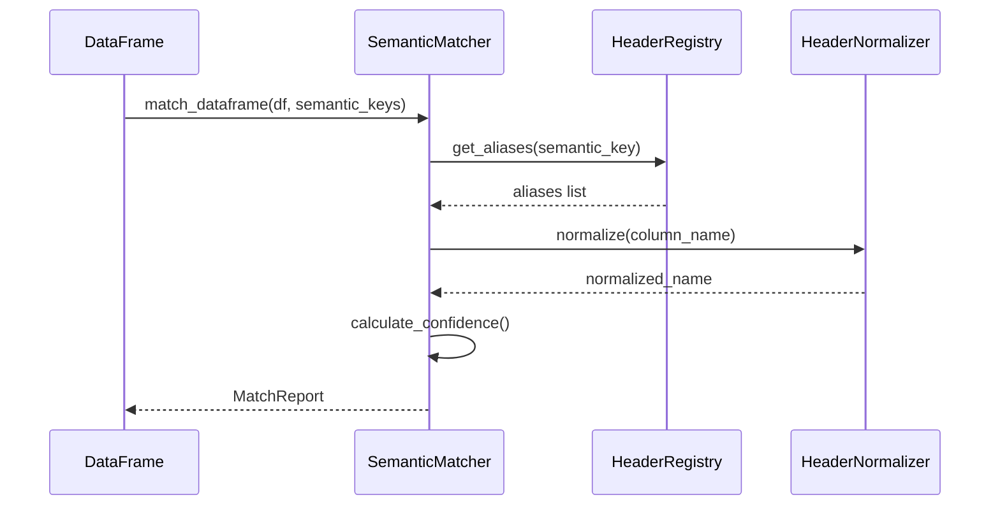

---

## Stage별 상세 아키텍처

### Stage 1: 데이터 동기화


### Stage 2: 파생 컬럼 생성

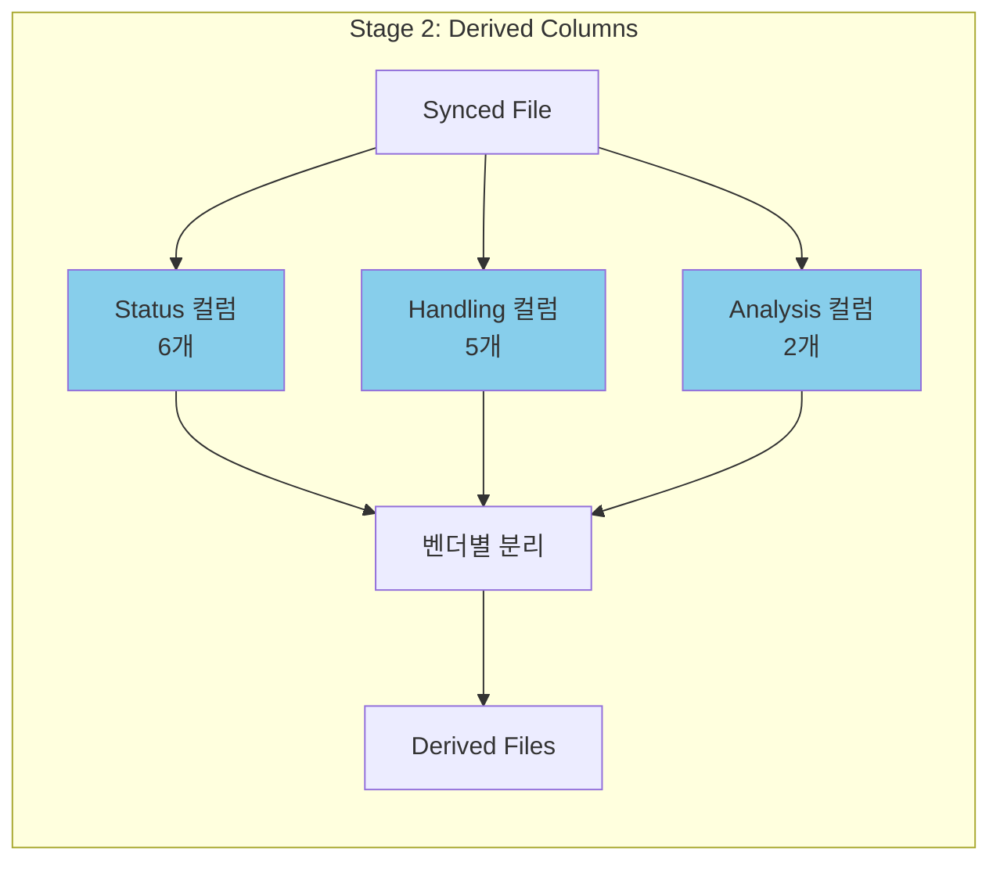

### Stage 3: 보고서 생성

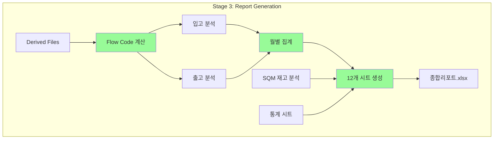

### Stage 4: 이상치 탐지

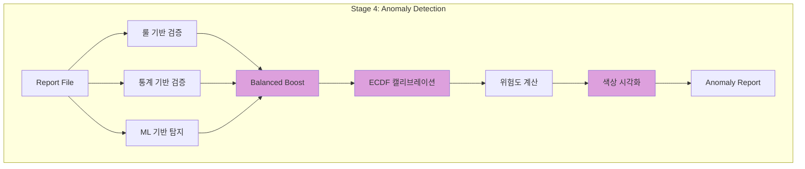

---

## 데이터 흐름

### 전체 데이터 변환 파이프라인

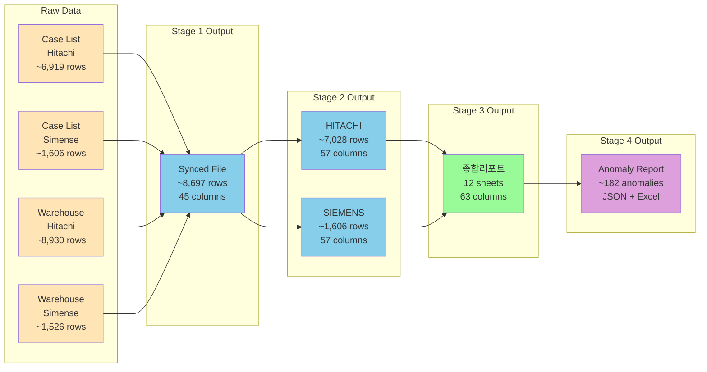

### 메타데이터 흐름

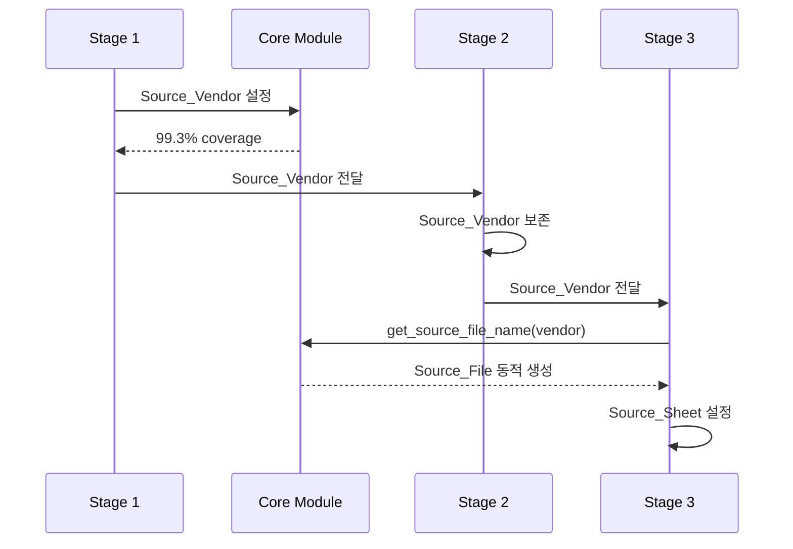

---

## 컴포넌트 상호작용

### Core 모듈과 Stage 간 상호작용

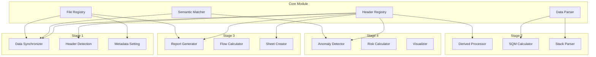

### 파일 탐지 및 선택 프로세스

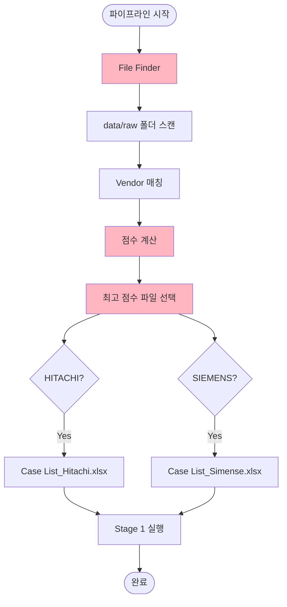

---

## 설정 및 구성

### 설정 파일 구조

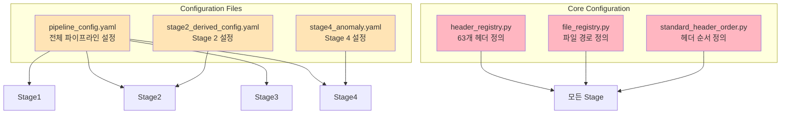

---

## 확장성 및 유지보수성

### 새 벤더 추가 프로세스

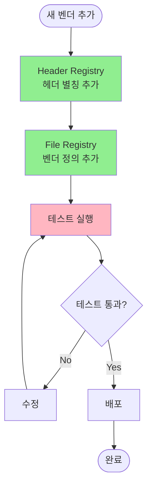

### 새 헤더 추가 프로세스

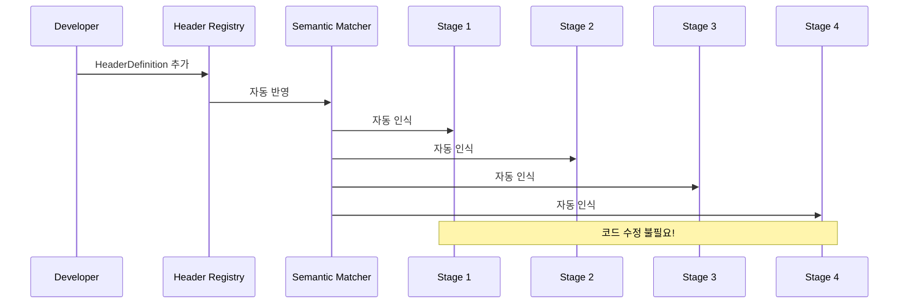

---

## 성능 최적화

### 벡터화 최적화 (Stage 3)

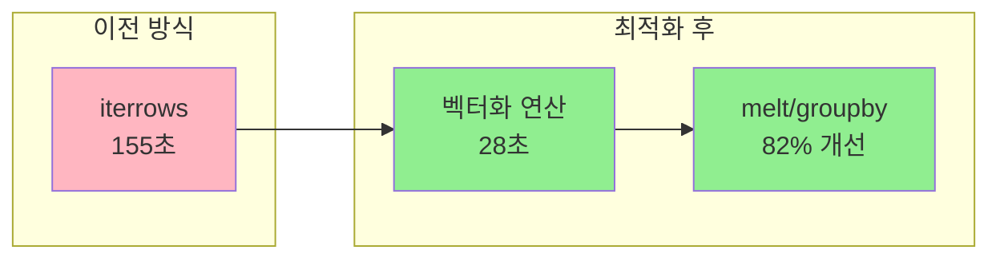

---

## 보안 및 데이터 무결성

### Raw Data Protection

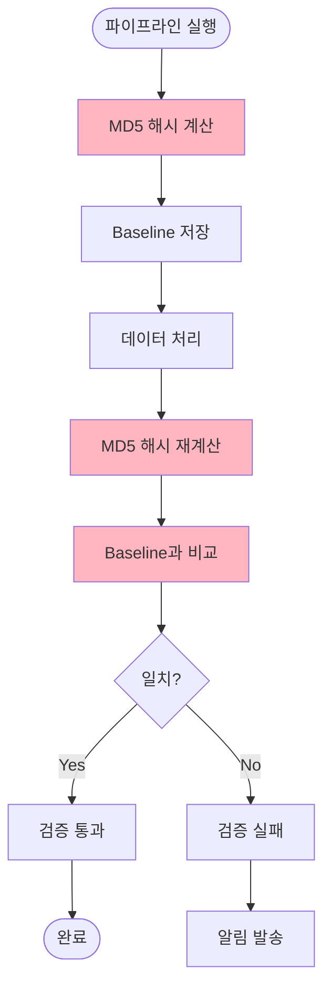

---

## 결론

HVDC Pipeline v4.0.54는 다음과 같은 아키텍처 특징을 가집니다:

1. **중앙 집중식 Core 모듈**: 모든 Stage가 공통 Core 모듈 사용
2. **의미 기반 매칭**: 하드코딩 완전 제거
3. **모듈화된 구조**: 각 Stage는 독립적이면서도 통합
4. **확장성**: 새 벤더/헤더 추가 시 Registry만 수정
5. **성능 최적화**: 벡터화 연산으로 82% 성능 개선
6. **데이터 무결성**: Raw Data Protection으로 검증

이 아키텍처는 유지보수성, 확장성, 성능을 모두 고려한 설계입니다.

---

**버전**: v4.0.54
**최종 업데이트**: 2025-01-25
**작성자**: AI Development Team

```

이 문서는 다음을 포함합니다:

1. 전체 시스템 아키텍처 다이어그램
2. Core 모듈 상세 구조
3. Stage별 상세 아키텍처
4. 데이터 흐름 및 변환 과정
5. 컴포넌트 간 상호작용
6. 설정 및 구성 관리
7. 확장성 및 유지보수성 가이드

모든 다이어그램은 Mermaid 형식으로 작성되어 GitHub, GitLab, Notion 등에서 렌더링됩니다.
```
