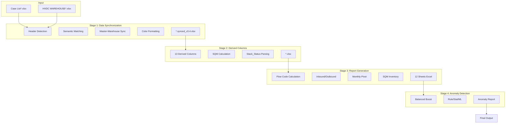
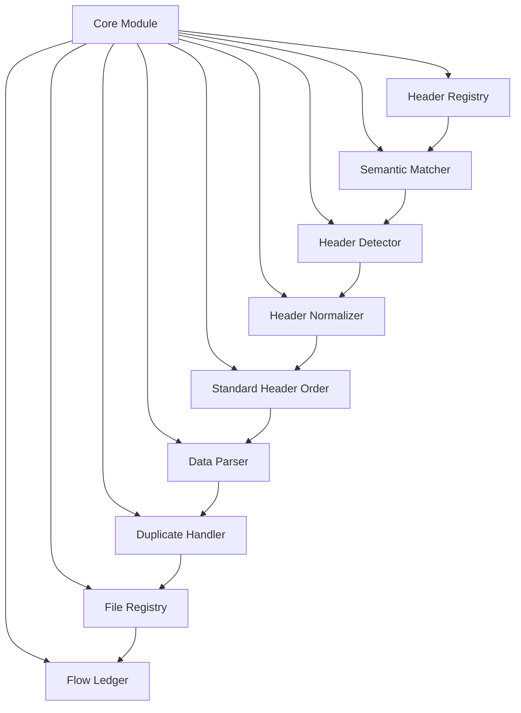

# HVDC 파이프라인 통합 아키텍처 문서

## 개요

HVDC 파이프라인은 4단계로 구성된 데이터 처리 시스템으로, 원본 Excel 파일에서부터 종합 보고서 및 이상치 탐지까지 전체 프로세스를 자동화합니다. Core 모듈을 통해 모든 Stage에서 일관된 헤더 관리와 데이터 처리를 보장합니다.

**버전**: v4.0.44  
**프로젝트**: HVDC PROJECT - Samsung C&T Logistics & ADNOC·DSV Strategic Partnership

---

## 전체 파이프라인 구조



---

## Stage 간 데이터 흐름

### Stage 1 → Stage 2

**입력**:
- `data/processed/synced/*.synced_v3.4_merged.xlsx`
- 멀티시트 파일도 지원 (자동 병합)

**처리**:
- 13개 파생 컬럼 계산
- SQM 및 Stack_Status 계산
- 표준 헤더 순서 재정렬 (63개)

**출력**:
- `data/processed/derived/HVDC WAREHOUSE_HITACHI(HE).xlsx`
- 57개 컬럼 (입력 45개 + 파생 13개 - 중복 제거)

**데이터 변환**:
- 행수: 유지 (7,276행)
- 컬럼: +13개 파생 컬럼
- 헤더: 표준 순서로 재정렬

### Stage 2 → Stage 3

**입력**:
- `data/processed/derived/HVDC WAREHOUSE_HITACHI(HE).xlsx`
- HITACHI + SIEMENS 데이터 병합

**처리**:
- Flow Code 계산 (0~5)
- 창고 입출고 계산
- 월별 피벗 테이블 생성
- SQM 기반 누적 재고 계산
- 일할 과금 시스템 적용

**출력**:
- `data/processed/reports/HVDC_입고로직_종합리포트_*.xlsx` (12개 시트)
- 표준 헤더 순서 (63개) 유지

**데이터 변환**:
- 행수: 유지 (7,276행)
- 컬럼: 63개 표준 헤더
- 추가 컬럼: FLOW_CODE, FLOW_DESCRIPTION, Final_Location 등

### Stage 3 → Stage 4

**입력**:
- `data/processed/reports/HVDC_입고로직_종합리포트_*.xlsx`
- "통합_원본데이터_Fixed" 시트

**처리**:
- Balanced Boost 이상치 탐지
- Rule-based, Statistical, ML 탐지
- ECDF 캘리브레이션
- 색상 시각화

**출력**:
- `data/anomaly/HVDC_anomaly_report.xlsx`
- `data/anomaly/HVDC_anomaly_report.json`

**데이터 변환**:
- 행수: 이상치만 필터링 (144건)
- 컬럼: 이상치 메타데이터 추가

---

## Core 모듈 의존성

### Core 모듈 구조



### Core 모듈별 역할

#### 1. Header Registry (`header_registry.py`)

**역할**: 중앙집중식 헤더 정의 및 관리

**주요 기능**:
- 시맨틱 키 및 별칭 정의
- 창고/현장 컬럼 목록 제공
- 날짜 컬럼 목록 제공
- 카테고리별 헤더 조회

**사용 Stage**: Stage 1, 2, 3, 4

**주요 클래스**:
- `HeaderRegistry`: 중앙 레지스트리
- `HeaderDefinition`: 헤더 정의
- `HeaderCategory`: 헤더 카테고리

#### 2. Semantic Matcher (`semantic_matcher.py`)

**역할**: 시맨틱 키 기반 컬럼 매칭

**주요 기능**:
- 정규화 → 별칭 매칭 → 신뢰도 점수
- Exact/Partial/Fuzzy 매칭 지원
- 매칭 리포트 생성

**사용 Stage**: Stage 1, 2, 3

**주요 클래스**:
- `SemanticMatcher`: 매칭 엔진
- `MatchReport`: 매칭 결과 리포트
- `MatchResult`: 개별 매칭 결과

#### 3. Header Detector (`header_detector.py`)

**역할**: Excel 파일에서 헤더 행 자동 탐지

**주요 기능**:
- 휴리스틱 기반 헤더 탐지
- 벤더별 기본 헤더 행 추론
- 신뢰도 점수 계산

**사용 Stage**: Stage 1

**주요 클래스**:
- `HeaderDetector`: 탐지 엔진
- `HeaderDetectionResult`: 탐지 결과

#### 4. Header Normalizer (`header_normalizer.py`)

**역할**: 헤더명 정규화 (공백, 대소문자, 별칭)

**주요 기능**:
- 공백 정규화
- 대소문자 통일
- 별칭 매핑

**사용 Stage**: Stage 1, 2, 3, 4

**주요 클래스**:
- `HeaderNormalizer`: 정규화 엔진

#### 5. Standard Header Order (`standard_header_order.py`)

**역할**: 표준 헤더 순서 재정렬 (63개)

**주요 기능**:
- Stage별 표준 헤더 순서 정의
- DataFrame 컬럼 재정렬
- 시맨틱 매칭으로 유연한 검색

**사용 Stage**: Stage 1, 2, 3

**주요 함수**:
- `reorder_dataframe_columns()`: 컬럼 재정렬
- `normalize_header_names_for_stage2/3()`: Stage별 정규화

#### 6. Data Parser (`data_parser.py`)

**역할**: 데이터 파싱 유틸리티 (Stack_Status, SQM)

**주요 기능**:
- Stack_Status 텍스트 파싱
- SQM 계산 (치수 기반)
- 단위 변환 (mm → cm)

**사용 Stage**: Stage 2, 3

**주요 함수**:
- `parse_stack_status()`: Stack 텍스트 파싱
- `calculate_sqm()`: SQM 계산

#### 7. Duplicate Handler (`duplicate_handler.py`)

**역할**: Case No. 기반 중복 제거

**주요 기능**:
- Case No. 정규화
- 중복 탐지 및 제거
- 전역 중복 플래그 계산

**사용 Stage**: Stage 1

**주요 함수**:
- `drop_duplicates_by_case()`: 중복 제거
- `normalize_case_series()`: Case No. 정규화

#### 8. File Registry (`file_registry.py`)

**역할**: 중앙집중식 파일 경로 관리

**주요 기능**:
- 파일 경로 자동 탐지
- 벤더별 파일 매핑
- 출력 파일 경로 생성

**사용 Stage**: 전체 (통합 실행 스크립트)

**주요 클래스**:
- `FileRegistry`: 파일 레지스트리

#### 9. Flow Ledger (`flow_ledger_v2.py`)

**역할**: 이벤트 기반 데이터 모델 및 월별 집계

**주요 기능**:
- Flow Ledger 생성
- 월별 입출고 집계
- 이벤트 기반 데이터 모델

**사용 Stage**: Stage 3

**주요 함수**:
- `build_flow_ledger()`: Flow Ledger 생성
- `monthly_inout_table()`: 월별 입출고 집계

---

## Stage별 Core 모듈 사용 현황

### Stage 1: Data Synchronization

**사용 Core 모듈**:
- `HeaderDetector`: 헤더 행 자동 탐지
- `SemanticMatcher`: 시맨틱 컬럼 매칭
- `HeaderRegistry`: 헤더 정의 조회
- `DuplicateHandler`: Case No. 기반 중복 제거
- `StandardHeaderOrder`: 표준 헤더 순서 재정렬

**의존성**:
```
Stage 1
├── HeaderDetector
│   └── HeaderRegistry
├── SemanticMatcher
│   ├── HeaderRegistry
│   └── HeaderNormalizer
├── DuplicateHandler
│   └── SemanticMatcher (optional)
└── StandardHeaderOrder
    ├── HeaderRegistry
    └── SemanticMatcher
```

### Stage 2: Derived Columns

**사용 Core 모듈**:
- `HeaderRegistry`: 창고/현장 컬럼 조회
- `DataParser`: Stack_Status 파싱, SQM 계산
- `StandardHeaderOrder`: 표준 헤더 순서 재정렬

**의존성**:
```
Stage 2
├── HeaderRegistry
│   └── get_warehouse_columns()
│   └── get_site_columns()
├── DataParser
│   └── parse_stack_status()
└── StandardHeaderOrder
    ├── HeaderRegistry
    └── SemanticMatcher
```

### Stage 3: Report Generation

**사용 Core 모듈**:
- `HeaderRegistry`: 창고/현장 컬럼 조회
- `FlowLedger`: 이벤트 기반 데이터 모델
- `StandardHeaderOrder`: 표준 헤더 순서 재정렬
- `DataParser`: Stack_Status 파싱

**의존성**:
```
Stage 3
├── HeaderRegistry
│   └── get_warehouse_columns()
│   └── get_site_columns()
├── FlowLedger
│   ├── HeaderRegistry
│   └── HeaderNormalizer
├── StandardHeaderOrder
│   ├── HeaderRegistry
│   └── SemanticMatcher
└── DataParser
    └── parse_stack_status()
```

### Stage 4: Anomaly Detection

**사용 Core 모듈**:
- `HeaderRegistry`: 창고/현장 컬럼 조회
- `HeaderNormalizer`: 헤더명 정규화

**의존성**:
```
Stage 4
├── HeaderRegistry
│   └── get_warehouse_columns()
│   └── get_site_columns()
└── HeaderNormalizer
```

---

## 설정 파일 구조

### pipeline_config.yaml

**전체 파이프라인 설정**:
```yaml
paths:
  data_root: data
  reports_root: data/processed/reports

stages:
  stage1:
    io:
      master_file: auto
      warehouse_file: data/raw/HVDC WAREHOUSE_HITACHI(HE).xlsx
      output_file: data/processed/synced/*.synced_v3.4.xlsx
    options:
      include_all_sheets: true
      include_sheet_patterns: [...]
  
  stage2:
    # stage2_derived_config.yaml 참조
  
  stage3:
    warehouse_config:
      base_capacity_sqm: {...}
      billing_mode: {...}
      sqm_rates: {...}
  
  stage4:
    # stage4_anomaly.yaml 참조
```

### stage2_derived_config.yaml

**Stage 2 전용 설정**:
```yaml
input:
  synced_file: data/processed/synced/*.synced_v3.4_merged.xlsx
output:
  derived_file: data/processed/derived/HVDC WAREHOUSE_HITACHI(HE).xlsx
columns:
  status_columns: [...]
  handling_columns: [...]
  analysis_columns: [...]
```

### stage4_anomaly.yaml

**Stage 4 전용 설정**:
```yaml
io:
  input_file: reports/HVDC_입고로직_종합리포트_latest.xlsx
  sheet_name: 통합_원본데이터_Fixed
model:
  contamination: 0.02
  random_state: 42
  use_pyod_first: true
```

---

## 성능 지표

### 전체 파이프라인 실행 시간 (7,276행 기준)

| Stage | 실행 시간 | 주요 작업 |
|-------|----------|----------|
| Stage 1 | ~76초 | 파일 로드, 헤더 탐지, 동기화, 색상 포맷팅 |
| Stage 2 | ~15초 | 파생 컬럼 계산, SQM/Stack 계산 |
| Stage 3 | ~70초 | 입출고 계산, 월별 피벗, SQM 계산 |
| Stage 4 | ~34초 | 이상치 탐지, Balanced Boost, 리포트 생성 |
| **총계** | **~195초** | **약 3분 15초** |

### 데이터 변환 통계

| Stage | 입력 행수 | 출력 행수 | 입력 컬럼 | 출력 컬럼 |
|-------|----------|----------|----------|----------|
| Stage 1 | 7,457 | 7,276 | 45 | 45 |
| Stage 2 | 7,276 | 7,276 | 45 | 57 |
| Stage 3 | 7,276 | 7,276 | 57 | 63 |
| Stage 4 | 7,276 | 144 | 63 | 9 (이상치) |

---

## 확장성 및 유지보수성

### 새 헤더 추가

1. `header_registry.py`에 `HeaderDefinition` 추가
2. 별칭 목록에 새 변형 추가
3. 코드 수정 불필요 (자동 인식)

### 새 창고/현장 추가

1. `header_registry.py`에 HeaderDefinition 추가
2. `pipeline_config.yaml`에 설정 추가 (Stage 3)
3. 코드 수정 불필요 (자동 인식)

### 새 Stage 추가

1. `scripts/stage{N}/` 디렉토리 생성
2. Core 모듈 활용 (HeaderRegistry, SemanticMatcher 등)
3. `run_pipeline.py`에 Stage 추가
4. `pipeline_config.yaml`에 설정 추가

### 새 벤더 지원

1. `file_registry.py`에 벤더 매핑 추가
2. `header_detector.py`에 벤더 기본 헤더 행 추가
3. `pipeline_config.yaml`에 벤더별 설정 추가

---

## 보안 및 품질 보증

### 데이터 무결성

- **중복 제거**: Case No. 기반 중복 제거
- **검증**: 데이터 품질 검증 (Stage 4)
- **교차 검증**: Status_Location vs 물리적 위치 (Stage 3)

### 코드 품질

- **타입 힌트**: 모든 함수에 타입 힌트 적용
- **문서화**: Docstring 포함
- **테스트**: 각 Stage별 테스트 코드

### 성능 최적화

- **벡터화**: pandas 벡터화 연산 활용
- **병렬 처리**: 대용량 데이터 처리 시 병렬화 (Stage 3)
- **캐싱**: 반복 계산 최소화

---

## 참고 문서

- [Stage 1 기술 문서](./PIPELINE_STAGE1_TECHNICAL.md)
- [Stage 2 기술 문서](./PIPELINE_STAGE2_TECHNICAL.md)
- [Stage 3 기술 문서](./PIPELINE_STAGE3_TECHNICAL.md)
- [Stage 4 기술 문서](./PIPELINE_STAGE4_TECHNICAL.md)
- [Core Module 통합 가이드](../scripts/core/INTEGRATION_GUIDE.md)
- [Header Registry 문서](../scripts/core/README.md)

