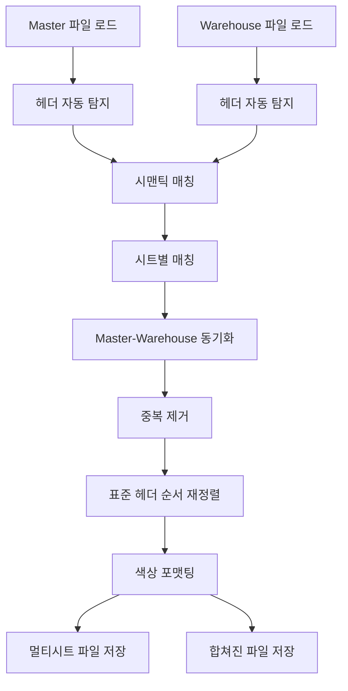

# Stage 1: 데이터 동기화 (Data Synchronization) 기술 문서

## 개요

Stage 1은 Master 파일과 Warehouse 파일을 동기화하여 통합된 데이터를 생성하는 단계입니다. Semantic Header Matching을 통해 헤더명 변형을 자동으로 인식하고, Multi-Sheet Processing으로 시트별 독립 처리를 수행합니다.

**버전**: v3.0 (Semantic Header Matching Edition)  
**핵심 스크립트**: `scripts/stage1_sync_sorted/data_synchronizer_v30.py`

---

## 사용 파일 목록

### 입력 파일

- **Master 파일**: `data/raw/Case List*.xlsx`
  - HITACHI 데이터 포함
  - SIEMENS 데이터는 자동 탐지하여 병합
- **Warehouse 파일**: `data/raw/HVDC WAREHOUSE_HITACHI(HE).xlsx`
  - 다중 시트 지원 (Case List, RIL, HE Local, HE-0214,0252 등)

### 출력 파일

- **멀티시트 파일**: `data/processed/synced/HVDC WAREHOUSE_HITACHI(HE).synced_v3.4.xlsx`
  - 원본 시트 구조 보존 (3개 시트)
  - 색상 포맷팅 적용
- **합쳐진 파일**: `data/processed/synced/HVDC WAREHOUSE_HITACHI(HE).synced_v3.4_merged.xlsx`
  - 단일 시트 (Stage 2 입력용)
  - Source_Sheet 컬럼 포함

### 핵심 스크립트

- `scripts/stage1_sync_sorted/data_synchronizer_v30.py` (2,706줄)
  - 메인 동기화 로직
  - Semantic Header Matching
  - Excel 색상 포맷팅

### Core 모듈

- `scripts/core/header_detector.py`
  - 헤더 행 자동 탐지
  - 벤더별 기본 헤더 행 추론 (SIEMENS=행0, HITACHI=행4)
- `scripts/core/semantic_matcher.py`
  - 시맨틱 컬럼 매칭
  - 정규화 및 별칭 매칭
- `scripts/core/header_registry.py`
  - 중앙집중식 헤더 정의
  - 시맨틱 키 및 별칭 관리
- `scripts/core/duplicate_handler.py`
  - Case No. 기반 중복 제거
  - 정규화 프로파일 관리
- `scripts/core/standard_header_order.py`
  - 표준 헤더 순서 재정렬 (63개)
  - Stage 간 일관성 유지

### 설정 파일

- `config/pipeline_config.yaml` (stage1 섹션)
  - 입력/출력 경로
  - 시트 포함 패턴
  - 정렬 옵션

---

## 주요 알고리즘

### 1. Semantic Header Matching

**목적**: 헤더명 변형을 자동으로 인식하여 하드코딩 제거

**구현**:
- `SemanticMatcher` 클래스 사용
- `HVDC_HEADER_REGISTRY`에서 시맨틱 키와 별칭 조회
- 정규화 → 별칭 매칭 → 신뢰도 점수 계산

**예시**:
```python
# "Case No.", "Case No", "CASE NO" 모두 "case_number"로 매칭
matcher = SemanticMatcher()
report = matcher.match_dataframe(df, ["case_number"])
case_col = report.get_column_name("case_number")  # "Case No." 반환
```

**장점**:
- Excel 파일 형식 변경 시 코드 수정 불필요
- 헤더명 변형 자동 처리
- 신뢰도 점수로 매칭 품질 평가

### 2. Multi-Sheet Processing

**목적**: 시트별 독립 처리 후 병합

**프로세스**:
1. 각 시트를 독립적으로 로드
2. 시트명 semantic matching으로 Master-Warehouse 매칭
3. 시트별 동기화 수행
4. 멀티시트 파일 + 합쳐진 파일 출력

**시트 매칭 로직**:
```python
def _find_matching_sheet(self, target_sheet: str, available_sheets: List[str]):
    # 1. Exact match (정규화 후)
    # 2. Alias matching (SHEET_NAME_ALIASES)
    # 3. Partial keyword matching (최소 2개 키워드 일치)
```

**시트 포함 패턴** (config에서 정의):
- `(?i)^case\\s*list`
- `(?i)^ril(\\s*\\(.*\\))?$`
- `(?i)^he\\s*local$`
- `(?i)^he[-_ ]?\\d+(?:\\s*,\\s*\\d+)*`
- `(?i)capacitor`

### 3. Case No. 기반 중복 제거

**목적**: 동일 Case No.의 중복 레코드 제거

**구현**:
- `drop_duplicates_by_case()` 함수 사용
- Case No. 정규화 (공백 제거, 대문자 변환, 구분자 통일)
- `keep="first"` 옵션으로 첫 번째 레코드 유지

**정규화 프로파일**:
```python
NormalizationProfile(
    squeeze_spaces=True,      # 공백 제거
    uppercase=True,           # 대문자 변환
    unify_sep=True,          # -, _, / 통일
    zero_pad_digits=None     # 숫자 패딩 (선택)
)
```

**예시**:
- "Case No. 123" → "CASENO123"
- "CASE-123" → "CASE123"
- "case_123" → "CASE123"

### 4. Master-Warehouse 동기화

**목적**: Master 데이터를 Warehouse에 적용하여 최신 상태 유지

**동기화 규칙**:

#### 날짜 컬럼 (Date Columns)
- Master 값이 있으면 항상 우선 (Master wins)
- 날짜 형식 차이 무시 (정규화 후 비교)
- 변경 시 Orange 색상 적용

#### 비날짜 컬럼 (Non-Date Columns)
- Master 값이 있으면 Warehouse 덮어쓰기
- `ALWAYS_OVERWRITE_NONDATE=True` 설정

#### 신규 레코드 (New Records)
- Master에만 있는 Case No.는 Warehouse에 추가
- 전체 행에 Yellow 색상 적용

#### Master-only 컬럼
- Master에만 있는 컬럼은 Warehouse에 추가
- 기존 행은 None으로 초기화

**동기화 통계**:
- `updates`: 변경된 셀 수
- `date_updates`: 날짜 변경 수
- `field_updates`: 필드 변경 수
- `appends`: 신규 레코드 수

### 5. Excel 색상 적용

**목적**: 변경사항을 시각적으로 표시

**색상 규칙**:
- **Orange (FFFFA500)**: 날짜 변경 셀
- **Yellow (FFFFFF00)**: 신규 레코드 전체 행

**색상 적용 프로세스**:
1. Case No. 기반 행 검색 (재정렬 후에도 정확한 위치 보장)
2. 3단계 Fallback 매칭:
   - Level 1: Semantic key 매핑 (가장 정확)
   - Level 2: Exact match (정확한 컬럼명)
   - Level 3: Fuzzy matching (유사도 기반)
3. 색상 적용 후 즉시 검증

**색상 검증**:
- 저장 후 파일을 다시 읽어 색상 확인
- 누락된 색상 경고 출력

---

## 데이터 흐름



### 상세 단계

#### Phase 1: 파일 로드
1. Master 파일 로드 (`_load_master_files()`)
   - HITACHI 파일 로드
   - SIEMENS 파일 자동 탐지 및 로드
   - Source_Vendor, Source_Sheet 메타데이터 추가
2. Warehouse 파일 로드 (`_load_file_by_sheets()`)
   - 시트별 독립 로드
   - 헤더 행 자동 탐지
   - 유효하지 않은 컬럼 필터링

#### Phase 2: 시트별 동기화
1. 시트 매칭 (`_find_matching_sheet()`)
   - Master 시트와 Warehouse 시트 semantic matching
2. 헤더 매칭 (`_match_and_validate_headers()`)
   - 시맨틱 키 → 실제 컬럼명 매핑
   - 필수 컬럼 검증
3. Master 순서 정렬 (`_apply_master_order_sorting()`)
   - Master NO. 기준 정렬
4. 데이터 동기화 (`_apply_updates()`)
   - 날짜 업데이트
   - 필드 업데이트
   - 신규 레코드 추가

#### Phase 3: 후처리
1. 중복 제거 (`drop_duplicates_by_case()`)
   - Case No. 기준 중복 제거
2. 표준 헤더 순서 재정렬 (`reorder_dataframe_columns()`)
   - 63개 표준 헤더 순서 적용
3. 색상 포맷팅 (`_apply_excel_formatting()`)
   - Orange: 날짜 변경
   - Yellow: 신규 레코드

#### Phase 4: 출력
1. 멀티시트 파일 저장
   - 원본 시트 구조 보존
2. 합쳐진 파일 저장
   - 단일 시트로 병합
   - Source_Sheet 컬럼 포함

---

## 핵심 클래스/함수

### DataSynchronizerV30

**메인 동기화 클래스**

**주요 메서드**:

#### `synchronize(master_xlsx, warehouse_xlsx, output_path) -> SyncResult`
- 전체 동기화 프로세스 실행
- Phase 1-4 순차 실행
- 결과 통계 반환

**반환값**:
```python
@dataclass
class SyncResult:
    success: bool
    message: str
    output_path: str
    merged_file: str
    stats: Dict[str, Any]
    matching_report: Optional[str]
```

#### `_load_file_by_sheets(file_path, file_label) -> Dict[str, Tuple[DataFrame, int]]`
- Excel 파일을 시트별로 로드
- 헤더 행 자동 탐지
- 시트별 DataFrame과 헤더 행 인덱스 반환

**헤더 탐지 우선순위**:
1. 수동 오버라이드 (manual override)
2. 자동 탐지 (heuristic)
3. 벤더 기본값 (vendor default)

#### `_match_and_validate_headers(df, file_label) -> Dict[str, str]`
- 시맨틱 키 → 실제 컬럼명 매핑
- 필수 컬럼 검증
- 매칭 리포트 생성

**매칭 키워드**:
- 필수: `case_number`
- 날짜: `etd_atd`, `eta_ata`, 창고/현장 날짜 컬럼
- 위치: 창고/현장 컬럼 (HeaderRegistry에서 조회)

#### `_apply_updates(master, wh, master_cols, wh_cols) -> Tuple[DataFrame, Dict]`
- Master 데이터를 Warehouse에 적용
- 변경사항 추적 (ChangeTracker)
- 통계 수집

**처리 순서**:
1. Case No. 인덱스 구축
2. 공통 컬럼 업데이트
3. Master-only 컬럼 추가
4. 신규 레코드 추가

#### `_apply_excel_formatting(excel_file, sheet_name, header_row)`
- Excel 파일에 색상 포맷팅 적용
- Case No. 기반 행 검색
- 3단계 Fallback 매칭

### HeaderDetector

**헤더 행 자동 탐지 클래스**

**주요 메서드**:

#### `detect_from_dataframe(df) -> Tuple[int, float]`
- DataFrame에서 헤더 행 탐지
- 휴리스틱 기반 점수 계산

**탐지 전략**:
1. 텍스트 밀도 (headers는 대부분 텍스트)
2. 고유값 비율 (headers는 고유)
3. 키워드 매칭 (common header keywords)
4. 데이터 타입 일관성

#### `detect_with_diagnostics(file_path, sheet_name, expected_columns) -> HeaderDetectionResult`
- 진단 정보와 함께 헤더 탐지
- 신뢰도 점수 및 경고 반환

### SemanticMatcher

**시맨틱 컬럼 매칭 엔진**

**주요 메서드**:

#### `match_dataframe(df, semantic_keys) -> MatchReport`
- DataFrame에서 시맨틱 키 매칭
- 정규화 → 별칭 매칭 → 신뢰도 점수

**매칭 전략**:
1. Exact match (정규화 후 정확 일치)
2. Partial match (부분 일치)
3. Fuzzy match (유사도 기반, 향후 확장)

#### `find_column(df, semantic_key, required=False) -> Optional[str]`
- 단일 시맨틱 키에 대한 컬럼 찾기
- HeaderRegistry에서 별칭 조회

### duplicate_handler 모듈

**중복 제거 유틸리티**

**주요 함수**:

#### `drop_duplicates_by_case(df, semantic_finder, keep, profile, preserve_empty_keys) -> DataFrame`
- Case No. 기준 중복 제거
- 정규화 프로파일 적용
- 빈 키 보존 옵션

#### `normalize_case_series(series, profile) -> Series`
- Case No. 시리즈 정규화
- 공백 제거, 대문자 변환, 구분자 통일

### standard_header_order 모듈

**표준 헤더 순서 관리**

**주요 함수**:

#### `reorder_dataframe_columns(df, is_stage2, keep_unlisted, use_semantic_matching) -> DataFrame`
- DataFrame 컬럼을 표준 순서로 재정렬
- 시맨틱 매칭으로 유연한 검색
- 63개 표준 헤더 순서 적용

---

## 설정 파일 구조

### pipeline_config.yaml (stage1 섹션)

```yaml
stages:
  stage1:
    description: 원본 데이터 동기화 및 정제
    enabled: true
    io:
      master_file: auto                    # 자동 탐지
      warehouse_file: data/raw/HVDC WAREHOUSE_HITACHI(HE).xlsx
      output_file: data/processed/synced/HVDC WAREHOUSE_HITACHI(HE).synced_v3.4.xlsx
    options:
      include_all_sheets: true
      include_sheet_patterns:
        - "(?i)^case\\s*list"
        - "(?i)^ril(\\s*\\(.*\\))?$"
        - "(?i)^he\\s*local$"
        - "(?i)^he[-_ ]?\\d+(?:\\s*,\\s*\\d+)*"
        - "(?i)capacitor"
      header_fallback: true
      strict_case_key: false
    sorting:
      enabled: true
      sort_by_master_no: true
```

---

## 성능 지표

### 실행 시간 (8,930행 기준, 2025-12-21 실행 결과)
- 파일 로드: ~60초
- 헤더 탐지 및 매칭: ~30초
- 데이터 동기화: ~120초
- 중복 제거: ~10초
- 색상 포맷팅: ~60초
- 표준 헤더 순서 재정렬: ~19초
- **총 실행 시간**: ~299.20초 (약 5분)

### 처리 통계 (실제 실행 결과 - 2025-12-21)
- 입력 행수: 9,209행 (원본)
- 출력 행수: 8,930행 (중복 제거 후)
- 처리된 시트: 3개 (Case List, RIL / HE Local / HE-0214,0252 (Capacitor))
- 날짜 업데이트: 19건
- 신규 레코드: 1,737건
- Orange 색상: 19개 셀 (날짜 변경)
- Yellow 색상: 48,829개 셀 (신규 레코드)
- 표준 헤더 정렬: 63개 컬럼
- 헤더 매칭률: 91.0% ~ 100.0% (시트별 상이)

---

## 주요 개선사항 (v3.0)

### Semantic Header Matching 도입
- 하드코딩된 컬럼명 완전 제거
- HeaderRegistry 기반 중앙 관리
- 헤더명 변형 자동 처리

### Multi-Sheet Processing
- 시트별 독립 처리
- 시트명 semantic matching
- 멀티시트 + 합쳐진 파일 이중 출력

### 색상 포맷팅 개선
- Case No. 기반 행 검색 (재정렬 후에도 정확)
- 3단계 Fallback 매칭
- 즉시 검증 시스템

### 데이터 무결성 강화
- Source_Vendor, Source_Sheet 메타데이터 자동 추가
- 데이터 손실 추적 (raw_rows vs processed_rows)
- 중복 제거 로직 개선

---

## 확장성 및 유지보수성

### 새 헤더 추가
1. `header_registry.py`에 HeaderDefinition 추가
2. 별칭 목록에 새 변형 추가
3. 코드 수정 불필요 (자동 인식)

### 새 시트 패턴 추가
1. `pipeline_config.yaml`의 `include_sheet_patterns`에 정규식 추가
2. 필요시 `SHEET_NAME_ALIASES`에 별칭 추가

### 새 벤더 지원
1. `_detect_vendor_and_header_row()`에 벤더 로직 추가
2. 벤더별 기본 헤더 행 정의
3. Source_Vendor 자동 추론 로직 확장

---

## 참고 문서

- [Core Module 통합 가이드](../scripts/core/INTEGRATION_GUIDE.md)
- [Header Registry 문서](../scripts/core/README.md)
- [Semantic Matcher 상세 설명](../scripts/core/semantic_matcher.py)

