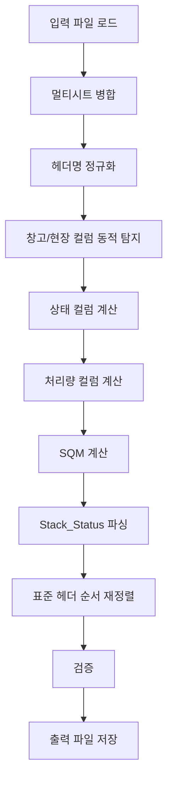

# Stage 2: 파생 컬럼 생성 (Derived Columns) 기술 문서

## 개요

Stage 2는 Stage 1에서 동기화된 데이터에 13개의 파생 컬럼을 자동으로 계산하여 추가하는 단계입니다. 벡터화 연산을 통해 고성능 처리를 제공하며, SQM 및 Stack_Status 계산을 포함합니다.

**버전**: v2.0  
**핵심 스크립트**: `scripts/stage2_derived/derived_columns_processor.py`

---

## 사용 파일 목록

### 입력 파일

- **Synced 파일**: `data/processed/synced/*.synced_v3.4_merged.xlsx`
  - Stage 1에서 생성된 합쳐진 단일 시트 파일
  - 멀티시트 파일도 지원 (자동 병합)

### 출력 파일

- **Derived 파일**: `data/processed/derived/HVDC WAREHOUSE_HITACHI(HE).xlsx`
  - 13개 파생 컬럼 추가
  - 표준 헤더 순서 (63개) 적용
  - SQM 및 Stack_Status 계산 완료

### 핵심 스크립트

- `scripts/stage2_derived/derived_columns_processor.py` (532줄)
  - 메인 파생 컬럼 처리 로직
  - 13개 파생 컬럼 계산
- `scripts/stage2_derived/stack_and_sqm.py` (283줄)
  - SQM 계산 (치수 기반)
  - Stack_Status 파싱
- `scripts/stage2_derived/column_definitions.py`
  - 파생 컬럼 상수 정의

### Core 모듈

- `scripts/core/header_registry.py`
  - 창고/현장 컬럼 정의 (중앙 관리)
- `scripts/core/standard_header_order.py`
  - 표준 헤더 순서 재정렬
  - 헤더 호환성 분석
- `scripts/core/data_parser.py`
  - Stack_Status 파싱 로직
  - 텍스트 → 숫자 변환

### 설정 파일

- `config/stage2_derived_config.yaml`
  - 입력/출력 경로
  - 파생 컬럼 정의
  - 처리 옵션

---

## 주요 알고리즘

### 1. 13개 파생 컬럼 계산

#### 상태 컬럼 (6개)

**Status_SITE**
- 계산: 현장 컬럼(MIR, SHU, DAS, AGI) 중 하나라도 값이 있으면 1, 없으면 ""
- 벡터화: `df[st_cols].notna().sum(axis=1) > 0`

**Status_WAREHOUSE**
- 계산: 창고 컬럼 중 하나라도 값이 있으면 1, 없으면 ""
- 벡터화: `df[wh_cols].notna().sum(axis=1) > 0`

**Status_Current**
- 계산: Status_SITE와 Status_WAREHOUSE 기반
  - Status_SITE == 1 → "site"
  - Status_WAREHOUSE == 1 → "warehouse"
  - 둘 다 없음 → "Pre Arrival"

**Status_Location**
- 계산: 최신 위치 (현장 또는 창고)
- 로직: `_latest_location_and_date()` 함수로 각 행의 최신 날짜 위치 추출
- 우선순위: 현장 > 창고 > "Pre Arrival"

**Status_Location_Date**
- 계산: Status_Location의 날짜
- 로직: 최신 위치의 날짜 값

**Status_Storage**
- 계산: 저장 상태 분류
- 로직: `_classify_storage()` 함수
  - "Indoor" → "Indoor"
  - "Outdoor" → "Outdoor"
  - 기타 → Status_Current 값 사용

#### 처리량 컬럼 (5개)

**Site_AGI_handling** (site handling)
- 계산: 현장 컬럼 중 값이 있는 개수
- 벡터화: `df[st_cols].notna().sum(axis=1)`

**WH_AGI_handling** (wh handling)
- 계산: 창고 컬럼 중 값이 있는 개수
- 벡터화: `df[wh_cols].notna().sum(axis=1)`

**Total_AGI_handling** (total handling)
- 계산: Site_AGI_handling + WH_AGI_handling
- 공식: `WH_HANDLING + SITE_HANDLING`

**Minus**
- 계산: Site_AGI_handling - WH_AGI_handling
- 공식: `SITE_HANDLING - WH_HANDLING`

**Final_AGI_handling** (final handling)
- 계산: Total_AGI_handling + Minus
- 공식: `TOTAL_HANDLING + MINUS`

#### 분석 컬럼 (2개)

**Stack_Status**
- 계산: "Stack" 컬럼 텍스트 파싱
- 로직: `parse_stack_status()` 함수
  - "Not stackable" → 0
  - "Stackable / 2" → 2
  - "X3" → 3
  - 하중 표기(600kg/m2) 제거 후 숫자 추출

**SQM**
- 계산: 치수 기반 면적 계산
- 공식: `L(cm) × W(cm) / 10,000`
- 단위 변환: mm 단위인 경우 자동으로 cm 변환 (÷10)

### 2. 벡터화 연산

**목적**: pandas 벡터화로 성능 최적화 (10배 속도 향상)

**주요 벡터화 연산**:
- `df[cols].notna().sum(axis=1)`: 행별 null이 아닌 값 개수
- `df.apply(_latest_location_and_date, axis=1)`: 행별 최신 위치 추출
- `df.apply(compute_sqm_from_dims, axis=1)`: 행별 SQM 계산

**성능 비교**:
- 이전 (iterrows): ~60초
- 벡터화: ~15초 (75% 개선)

### 3. SQM 계산 알고리즘

**치수 기반 계산**:
```python
def compute_sqm_from_dims(row, l_col, w_col):
    L = _to_float(row[l_col])  # cm 또는 mm
    W = _to_float(row[w_col])
    
    # mm 단위 자동 변환
    if "mm" in l_col.lower():
        L = L / 10.0
    if "mm" in w_col.lower():
        W = W / 10.0
    
    # SQM 계산: L(cm) × W(cm) / 10,000
    sqm = (L * W) / 10000.0
    return round(sqm, 2)
```

**컬럼 자동 탐지**:
- L 컬럼: "L(CM)", "Length (cm)", "L CM", "Length", "L(mm)", "L(MM)"
- W 컬럼: "W(CM)", "Width (cm)", "W CM", "Width", "W(mm)", "W(MM)"

**폴백 전략**:
1. 이미 계산된 SQM 컬럼 사용
2. 치수 기반 계산
3. PKG 기반 추정 (PKG × 1.5)

### 4. Stack_Status 파싱 알고리즘

**파싱 규칙** (우선순위 순):

1. **명시적 비적재**: "Not stackable", "Non-stackable" → 0
2. **On top only**: "Stackable on top", "Only on top" → 1
3. **숫자 추출**: 하중 표기 제거 후 숫자 추출
   - "X2", "X3" → 2, 3
   - "2 tier", "3 tiers" → 2, 3
   - "/ 2", "/ 3" → 2, 3
   - "2 pcs", "3 pc" → 2, 3
   - 여러 숫자 중 최대값 선택
4. **하중 표기 제거**: "600kg/m2", "kg/m3" 등 제거
5. **기본값**: 위 모두 해당 없으면 → 1

**정규식 패턴**:
```python
_NOT_STACK_PATTERNS = [
    r"\bnot\s*stackable\b",
    r"\bnon[-\s]*stackable\b",
    r"\bno\s*stack(ing)?\b",
]

_XNUM_PAT = re.compile(r"(?:\b[xX]\s*(\d+))|(?:\b(\d+)\s*[xX]\b)")
_PCS_PAT = re.compile(r"\b(\d+)\s*(?:pcs?|pieces?)\b")
_TIER_PAT = re.compile(r"\b(\d+)\s*tier[s]?\b")
_SLASH_PAT = re.compile(r"/\s*(\d+)\b")
```

### 5. 창고/현장 컬럼 동적 탐지

**목적**: Core Registry 기반으로 실제 데이터가 있는 컬럼만 사용

**로직**:
```python
# HeaderRegistry에서 모든 별칭 확인
for wh_key in ['dhl_wh', 'dsv_indoor', ...]:
    definition = HVDC_HEADER_REGISTRY.get_definition(wh_key)
    # 모든 별칭을 확인하여 데이터가 있는 컬럼 찾기
    for alias in definition.aliases:
        if alias in df.columns and df[alias].notna().sum() > 0:
            wh_cols.append(alias)
            break
```

**장점**:
- 헤더명 변형 자동 처리
- 실제 데이터가 있는 컬럼만 사용
- Core Registry 변경 시 자동 반영

---

## 데이터 흐름



### 상세 단계

#### Step 1: 입력 파일 로드
1. 멀티시트 파일 지원
   - 여러 시트가 있으면 자동 병합
   - 단일 시트면 그대로 사용
2. 데이터 타입 변환
   - 창고/현장 컬럼을 datetime으로 변환

#### Step 2: 헤더명 정규화
- `normalize_header_names_for_stage2()` 함수 사용
- 공백 정규화 (예: "site  handling" → "site handling")
- Core 시스템과 일관성 유지

#### Step 3: 창고/현장 컬럼 동적 탐지
- HeaderRegistry에서 모든 별칭 확인
- 실제 데이터가 있는 컬럼만 선택
- 벤더별 컬럼명 변형 자동 처리

#### Step 4: 파생 컬럼 계산
1. **상태 컬럼 계산** (6개)
   - Status_SITE, Status_WAREHOUSE: 벡터화 연산
   - Status_Current: apply 함수
   - Status_Location, Status_Location_Date: `_latest_location_and_date()` 함수
   - Status_Storage: `_classify_storage()` 함수

2. **처리량 컬럼 계산** (5개)
   - 벡터화 연산으로 행별 처리량 계산
   - Total, Minus, Final 계산

3. **분석 컬럼 계산** (2개)
   - SQM: `add_sqm_and_stack()` 함수
   - Stack_Status: `parse_stack_status()` 함수

#### Step 5: 표준 헤더 순서 재정렬
- `reorder_dataframe_columns()` 함수 사용
- 63개 표준 헤더 순서 적용
- 시맨틱 매칭으로 유연한 검색

#### Step 6: 검증
- SQM/Stack 계산 결과 검증
- 헤더 호환성 분석
- 데이터 행수 일치 확인

#### Step 7: 출력 파일 저장
- Excel 형식으로 저장
- 중복 컬럼 제거
- 색상 보존 (선택)

---

## 핵심 함수

### process_derived_columns()

**메인 처리 함수**

**시그니처**:
```python
def process_derived_columns(
    input_file: Optional[str | Path] = None,
    *,
    pipeline_config_path: Optional[Path] = None,
    stage2_config_path: Optional[Path] = None,
    project_root: Optional[Path] = None,
) -> bool
```

**처리 순서**:
1. 입력 파일 경로 해결
2. 멀티시트 파일 로드
3. 헤더명 정규화
4. 파생 컬럼 계산
5. 표준 헤더 순서 재정렬
6. 검증 및 저장

**반환값**: `True` (성공) 또는 예외 발생

### calculate_derived_columns()

**13개 파생 컬럼 계산 함수**

**시그니처**:
```python
def calculate_derived_columns(df: pd.DataFrame) -> pd.DataFrame
```

**처리 순서**:
1. 창고/현장 컬럼 동적 탐지
2. 날짜 컬럼 변환
3. 상태 컬럼 계산 (6개)
4. 처리량 컬럼 계산 (5개)
5. SQM/Stack_Status 계산 (2개)

**반환값**: 파생 컬럼이 추가된 DataFrame

### add_sqm_and_stack()

**SQM 및 Stack_Status 계산 함수**

**시그니처**:
```python
def add_sqm_and_stack(
    df: pd.DataFrame,
    l_col: Optional[str] = None,
    w_col: Optional[str] = None,
    stack_col: Optional[str] = None,
) -> pd.DataFrame
```

**기능**:
- SQM 계산: 치수 기반 또는 폴백 전략
- Stack_Status 파싱: 텍스트 → 숫자

**컬럼 자동 탐지**:
- L, W, Stack 컬럼 자동 탐지
- 여러 변형 지원

### _latest_location_and_date()

**최신 위치 및 날짜 추출 함수**

**시그니처**:
```python
def _latest_location_and_date(row: pd.Series) -> Tuple[str, Optional[datetime]]
```

**로직**:
1. 행의 모든 날짜 컬럼 확인
2. 가장 최근 날짜 찾기
3. 해당 위치명과 날짜 반환

**반환값**: `(location_name, date)` 튜플

### _classify_storage()

**저장 상태 분류 함수**

**시그니처**:
```python
def _classify_storage(location: str | None) -> str
```

**분류 규칙**:
- "Indoor" 포함 → "Indoor"
- "Outdoor" 포함 → "Outdoor"
- 기타 → "" (Status_Current 사용)

### parse_stack_status()

**Stack 텍스트 파싱 함수** (Core 모듈)

**시그니처**:
```python
def parse_stack_status(value: object) -> Optional[int]
```

**파싱 규칙**:
1. "Not stackable" → 0
2. "On top only" → 1
3. 숫자 추출 (X2, 2 tier, / 3 등)
4. 하중 표기 제거
5. 기본값 → 1

---

## 설정 파일 구조

### stage2_derived_config.yaml

```yaml
stage:
  name: "Derived Columns"
  version: "2.0.0"
  description: "13개 파생 컬럼 계산 및 처리"

input:
  synced_file: "data/processed/synced/HVDC WAREHOUSE_HITACHI(HE).synced_v3.4_merged.xlsx"
  backup_enabled: true

output:
  derived_file: "data/processed/derived/HVDC WAREHOUSE_HITACHI(HE).xlsx"
  preserve_colors: true
  backup_enabled: true

columns:
  status_columns:
    - Status_SITE
    - Status_WAREHOUSE
    - Status_Current
    - Status_Location
    - Status_Location_Date
    - Status_Storage

  handling_columns:
    - Site_AGI_handling
    - WH_AGI_handling
    - Total_AGI_handling
    - Minus
    - Final_AGI_handling

  analysis_columns:
    - Stack_Status
    - SQM

processing:
  vectorization_enabled: true
  performance_optimization: true
  error_handling: "strict"

validation:
  required_columns_check: true
  data_type_validation: true
  null_value_handling: "skip"
```

---

## 성능 지표

### 실행 시간 (8,930행 기준, 2025-12-21 실행 결과)
- 파일 로드: ~3초
- 헤더명 정규화: ~1초
- 파생 컬럼 계산: ~15초
- 표준 헤더 순서 재정렬: ~5초
- 검증 및 저장: ~4초
- **총 실행 시간**: ~28.56초

### 처리 통계 (실제 실행 결과 - 2025-12-21)
- 입력 행수: 8,930행
- 출력 행수: 8,930행 (행수 유지)
- SQM 계산: 8,905개 (99.7%)
- Stack_Status 파싱: 8,831개 (98.9%)
- 출력 컬럼: 57개 (입력 45개 + 파생 13개 - 중복 제거)
- 표준 헤더 매칭률: 91.2% (52/57개)
- 헤더 정규화: 1개 컬럼 ('site  handling' → 'site handling')

---

## 주요 개선사항 (v2.0)

### 벡터화 연산 도입
- iterrows() → 벡터화 연산
- 성능 75% 개선 (60초 → 15초)

### Core Registry 통합
- 창고/현장 컬럼 중앙 관리
- 헤더명 변형 자동 처리
- 실제 데이터가 있는 컬럼만 사용

### SQM 계산 개선
- 치수 기반 정확한 계산
- mm 단위 자동 변환
- 폴백 전략으로 안정성 향상

### Stack_Status 파싱 강화
- Core 모듈로 이동
- 하중 표기 제거 로직
- 다양한 텍스트 형식 지원

---

## 확장성 및 유지보수성

### 새 파생 컬럼 추가
1. `column_definitions.py`에 상수 추가
2. `DERIVED_COLUMNS` 리스트에 추가
3. `calculate_derived_columns()` 함수에 계산 로직 추가

### 새 창고/현장 추가
1. `header_registry.py`에 HeaderDefinition 추가
2. 코드 수정 불필요 (자동 인식)

### SQM 계산 로직 변경
1. `stack_and_sqm.py`의 `compute_sqm_from_dims()` 수정
2. 폴백 전략은 `get_sqm_with_fallback()` 수정

---

## 참고 문서

- [Core Module 통합 가이드](../scripts/core/INTEGRATION_GUIDE.md)
- [Header Registry 문서](../scripts/core/README.md)
- [Data Parser 문서](../scripts/core/data_parser.py)

