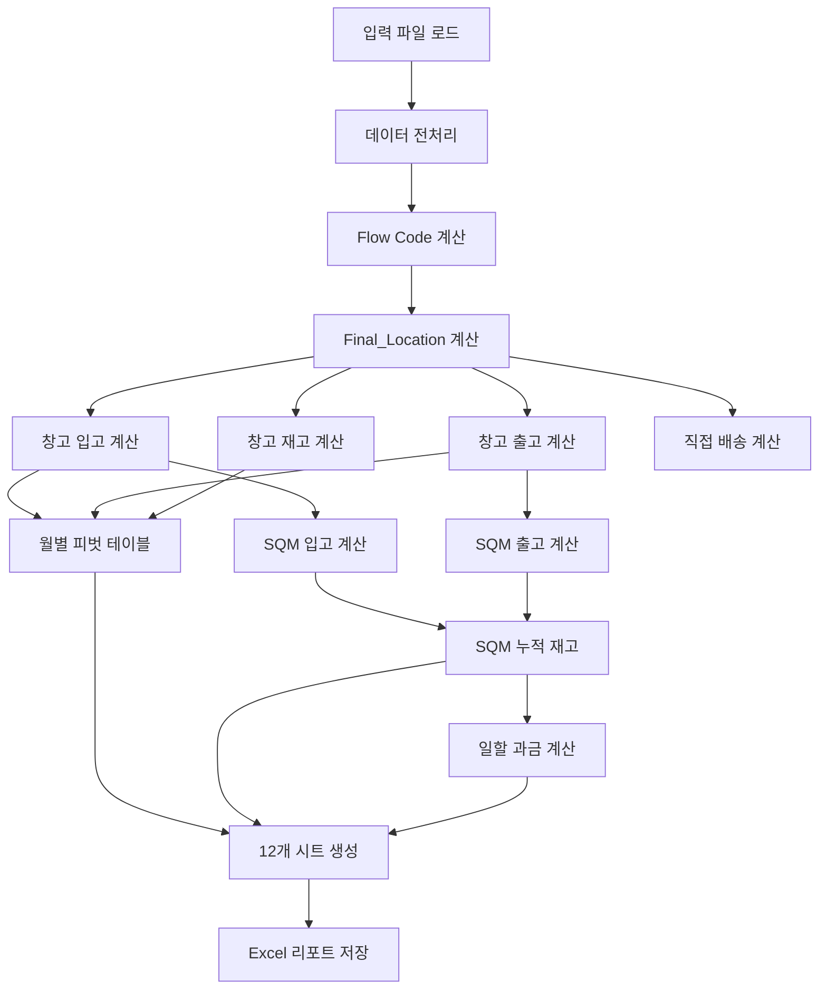

# Stage 3: 보고서 생성 (Report Generation) 기술 문서

## 개요

Stage 3는 Stage 2에서 생성된 파생 컬럼 데이터를 기반으로 창고 입출고 계산, 월별 피벗 테이블, SQM 기반 누적 재고, 일할 과금 시스템을 포함한 종합 보고서를 생성하는 단계입니다.

**버전**: v3.0-corrected  
**핵심 스크립트**: `scripts/stage3_report/report_generator.py`, `hvdc_excel_reporter_final_sqm_rev.py`

---

## 사용 파일 목록

### 입력 파일

- **Derived 파일**: `data/processed/derived/HVDC WAREHOUSE_HITACHI(HE).xlsx`
  - Stage 2에서 생성된 파생 컬럼 포함 데이터
- **SIEMENS 파일**: `data/processed/derived/HVDC WAREHOUSE_SIMENSE(SIM).xlsx` (선택)
  - SIEMENS 데이터 병합용

### 출력 파일

- **종합 보고서**: `data/processed/reports/HVDC_입고로직_종합리포트_*.xlsx` (12개 시트)
  1. 창고_월별_입출고 (Multi-Level Header, 17열)
  2. 현장_월별_입고재고 (Multi-Level Header, 9열)
  3. Flow_Code_분석
  4. 전체_트랜잭션_요약
  5. KPI_검증_결과
  6. 원본_데이터_샘플
  7. HITACHI_원본데이터_Fixed
  8. SIEMENS_원본데이터_Fixed
  9. 통합_원본데이터_Fixed (63개 표준 헤더)
  10. SQM_누적_재고
  11. SQM_Invoice_과금
  12. SQM_피벗_테이블

### 핵심 스크립트

- `scripts/stage3_report/report_generator.py` (4,750줄)
  - 메인 리포트 생성 로직
  - 입출고 계산 알고리즘
- `scripts/stage3_report/hvdc_excel_reporter_final_sqm_rev.py` (2,950줄)
  - Excel 리포트 생성 및 포맷팅
- `scripts/core/flow_ledger_v2.py`
  - Flow Ledger 기반 월별 입출고 계산
  - 이벤트 기반 데이터 모델

### Core 모듈

- `scripts/core/header_registry.py`
  - 창고/현장 컬럼 정의
- `scripts/core/standard_header_order.py`
  - 표준 헤더 순서 재정렬 (63개)
- `scripts/core/flow_ledger_v2.py`
  - Flow Ledger 생성 및 월별 집계

### 설정 파일

- `config/pipeline_config.yaml` (stage3 섹션)
  - 입력/출력 경로
  - 창고별 SQM 용량 설정
  - 과금 모드 및 단가 설정

---

## 주요 알고리즘

### 1. Hybrid 창고 입고 계산

**목적**: 순수 입고와 창고간 이동을 구분하여 정확한 입고량 계산

**하이브리드 방식**:
- **루프 기반**: 순수 입고 계산 (정확성 우선)
- **벡터화**: 창고간 이동 감지 (성능 우선)

**입고 계산 규칙**:
1. **순수 입고 (external_arrival)**
   - 창고 컬럼에 값이 있고
   - 창고간 이동의 목적지가 아닌 경우
   - Inbound_Type = "external_arrival"

2. **창고간 이동 입고**
   - 동일 날짜에 두 창고에 값이 있는 경우
   - from_warehouse → to_warehouse 이동
   - 별도 리스트로 관리 (warehouse_transfers)

**코드 구조**:
```python
def calculate_warehouse_inbound_corrected(self, df):
    # 1. 창고간 이동 감지 (벡터화)
    transfers_flat = self._vectorized_detect_warehouse_transfers_batch(df)
    
    # 2. 순수 입고 계산 (루프 기반)
    for idx, row in df.iterrows():
        # 창고간 이동 목적지 제외
        if warehouse in transfer_destinations:
            continue
        # 순수 입고 추가
        inbound_items.append({...})
```

### 2. 벡터화 창고 출고 계산

**목적**: 창고에서 다른 위치로의 실제 이동만 출고로 계산

**출고 계산 규칙**:
1. **창고간 이동 출고**
   - 동일 날짜 창고간 이동
   - from_warehouse에서 출고
   - Outbound_Type = "warehouse_transfer"

2. **창고→현장 출고**
   - 창고 입고일 이후 현장 이동
   - 다음 날 이동만 인정 (동일 날짜 제외)
   - Outbound_Type = "warehouse_to_site"

**벡터화 전략**:
```python
def _calculate_warehouse_outbound_vectorized(self, df):
    # 1. 창고간 이동 출고 (완전 벡터화)
    transfers_flat = self._vectorized_detect_warehouse_transfers_batch(df)
    transfer_grouped = transfers_flat.groupby(["from_warehouse", "Year_Month"])["Pkg_Quantity"].sum()
    
    # 2. 창고→현장 출고 (루프 기반 - 정확성 우선)
    for idx, row in df.iterrows():
        # 가장 빠른 현장 이동 찾기
        next_site_movements = [...]
        if next_site_movements:
            next_site, next_date = min(next_site_movements, key=lambda x: x[1])
            outbound_items.append({...})
```

### 3. 창고 재고 계산

**목적**: Status_Location과 물리적 위치를 교차 검증하여 정확한 재고 계산

**3단계 검증 구조**:
1. **Status_Location 재고** (월말 기준)
   - Status_Location 컬럼 기반
   - 월별 그룹화 (pd.Grouper)

2. **물리적 위치 재고** (도착일자 기준)
   - 창고/현장 컬럼의 날짜 값 기반
   - 월별 그룹화

3. **교차 검증**
   - verified_inventory = min(status_inventory, physical_inventory)
   - diff = status_inventory - physical_inventory
   - 불일치 탐지 (임계값 10건 이상)

**코드 구조**:
```python
def calculate_warehouse_inventory_corrected(self, df):
    # 1. Status_Location 재고
    status_inv = df.groupby(["Status_Location", pd.Grouper(key=primary_date_col, freq="M")])["Pkg"].sum()
    
    # 2. 물리적 위치 재고
    phys_df = pd.concat(frames, ignore_index=True)
    physical_inv = phys_df.groupby(["Location", pd.Grouper(key="arrival", freq="M")])["Pkg"].sum()
    
    # 3. 병합 & 차이 계산
    inv = pd.concat([status_inv, physical_inv], axis=1).fillna(0)
    inv["verified_inventory"] = inv[["status_inventory", "physical_inventory"]].min(axis=1)
    inv["diff"] = inv["status_inventory"] - inv["physical_inventory"]
```

### 4. Flow Code 분류 시스템 (v3.5)

**목적**: 물류 흐름을 0~5 코드로 분류하여 분석 및 KPI 계산

**Flow Code 정의**:
- **Flow 0**: Pre Arrival (도착 전)
- **Flow 1**: Port → Site (직접 배송)
- **Flow 2**: Port → WH → Site (창고 경유)
- **Flow 3**: Port → MOSB → Site (MOSB 경유)
- **Flow 4**: Port → WH → MOSB → Site (창고 + MOSB 경유)
- **Flow 5**: Mixed / Waiting / Incomplete leg (혼합 케이스)

**AGI/DAS 도메인 룰**:
- AGI/DAS가 Final_Location인 경우 강제 Flow 3 승급
- MOSB 경유 필수 (도메인 요구사항)

**계산 로직**:
```python
def recalculate_flow_code(self):
    # 1. 창고/오프쇼어 분리
    WH_COLS = [w for w in self.warehouse_columns if w != "MOSB"]
    MOSB_COLS = [w for w in self.warehouse_columns if w == "MOSB"]
    
    # 2. 관측값 계산
    wh_cnt = df[WH_COLS].notna().sum(axis=1)
    has_mosb = df[MOSB_COLS].notna().any(axis=1)
    has_site = df[SITE_COLS].notna().any(axis=1)
    
    # 3. 기본 Flow 계산
    flow = pd.Series(0, index=df.index)
    flow[is_pre_arrival] = 0
    flow[not_pre & (wh_cnt == 0) & (~has_mosb)] = 1
    flow[not_pre & (wh_cnt >= 1) & (~has_mosb)] = 2
    flow[not_pre & (wh_cnt == 0) & has_mosb] = 3
    flow[not_pre & (wh_cnt >= 1) & has_mosb] = 4
    
    # 4. AGI/DAS 강제 승급
    is_agi_das = final_location.isin(["AGI", "DAS"])
    need_force = is_agi_das & flow.isin([0, 1, 2])
    flow[need_force] = 3
    
    # 5. 혼합 케이스 → Flow 5
    need_5 = (has_mosb & (~has_site)) | ((wh_cnt >= 2) & (~has_mosb))
    flow[need_5] = 5
```

### 5. SQM 기반 누적 재고 계산

**목적**: SQM 단위로 누적 재고를 계산하여 창고 이용률 산출

**계산 공식**:
- **입고 SQM**: 입고일 × SQM × Stack_Status
- **출고 SQM**: 출고일 × SQM × Stack_Status
- **누적 재고 SQM**: 입고 SQM - 출고 SQM (월별 누적)
- **이용률**: (누적 재고 SQM / Base Capacity SQM) × 100

**스냅샷 앵커링**:
- 월별 누적 재고를 실제 스냅샷 데이터에 맞춰 보정
- delta = snapshot[warehouse] - last_flow
- 누적 컬럼 전체에 delta 추가

**코드 구조**:
```python
def calculate_cumulative_sqm_inventory(self, sqm_inbound, sqm_outbound):
    cumulative = {}
    for month in sorted(months):
        for warehouse in warehouses:
            inbound = sqm_inbound.get(month, {}).get(warehouse, 0)
            outbound = sqm_outbound.get(month, {}).get(warehouse, 0)
            prev_cumulative = cumulative.get(prev_month, {}).get(warehouse, 0)
            cumulative[warehouse] = prev_cumulative + inbound - outbound
            utilization = (cumulative[warehouse] / base_capacity) * 100
```

### 6. 일할 과금 시스템

**목적**: 창고별 과금 모드에 따라 차등 과금 계산

**과금 모드**:
- **Rate 모드**: SQM × Rate × 일할계수
  - DSV Outdoor: 18 AED/sqm/month
  - DSV MZP: 33 AED/sqm/month
  - DSV Indoor: 47 AED/sqm/month
  - DSV Al Markaz: 47 AED/sqm/month
  - JDN MZD: 33 AED/sqm/month

- **Passthrough 모드**: 외부 인보이스 금액 그대로 전달
  - AAA Storage, Hauler Indoor, DHL Warehouse

- **No-charge 모드**: 과금 없음
  - MOSB

**일할 계산**:
- 일할계수 = (월말일 - 입고일 + 1) / 월말일
- 월별 평균 SQM = (입고 SQM × 일할계수)의 합

**코드 구조**:
```python
def calculate_monthly_invoice_charges_prorated(self, df, passthrough_amounts):
    charges = {}
    for month in months:
        for warehouse in warehouses:
            billing_mode = self.billing_mode[warehouse]
            if billing_mode == "rate":
                avg_sqm = calculate_prorated_avg_sqm(df, warehouse, month)
                rate = self.warehouse_sqm_rates[warehouse]
                monthly_charge = avg_sqm * rate
            elif billing_mode == "passthrough":
                monthly_charge = passthrough_amounts.get(warehouse, 0)
            else:  # no-charge
                monthly_charge = 0
            charges[month][warehouse] = {...}
```

### 7. 월별 피벗 테이블 생성

**목적**: Flow Ledger 기반으로 월별 입출고 피벗 테이블 생성

**Flow Ledger 기반**:
- `build_flow_ledger()`: 이벤트 기반 데이터 모델 생성
- `monthly_inout_table()`: 월별 입출고 집계
- 누적 재고 및 이용률 자동 계산

**Multi-Level Header**:
- 창고별 17열: 입고, 출고, 누적, 이용률 (월별)
- 현장별 9열: 입고, 재고 (월별)

**코드 구조**:
```python
def create_warehouse_monthly_sheet_enhanced(self, stats):
    # Flow Ledger 생성
    ledger_df, edges_df = build_flow_ledger(master_df)
    
    # 월별 입출고 집계
    warehouse_monthly = monthly_inout_table(ledger_df, warehouse_labels, end_month=unified_end_month)
    
    # Multi-Level Header 적용
    warehouse_monthly_with_headers = self.create_multi_level_headers(warehouse_monthly, "warehouse")
```

---

## 데이터 흐름



### 상세 단계

#### Step 1: 데이터 로드 및 전처리
1. HITACHI + SIEMENS 데이터 로드
2. 데이터 병합 및 정제
3. 헤더명 정규화

#### Step 2: Flow Code 계산
1. 창고/오프쇼어 분리
2. 관측값 계산 (wh_cnt, has_mosb, has_site)
3. 기본 Flow 계산 (0~4)
4. AGI/DAS 강제 승급
5. 혼합 케이스 처리 (Flow 5)

#### Step 3: Final_Location 계산
1. Status_Location 우선 사용
2. 없으면 최신 위치로 계산

#### Step 4: 입출고 계산
1. **창고 입고**: Hybrid 방식 (루프 + 벡터화)
2. **창고 출고**: 벡터화 방식
3. **창고 재고**: 3단계 검증
4. **직접 배송**: Flow Code 1인 경우

#### Step 5: 월별 피벗 테이블
1. Flow Ledger 생성
2. 월별 입출고 집계
3. 누적 재고 및 이용률 계산

#### Step 6: SQM 기반 계산
1. 월별 SQM 입고 계산
2. 월별 SQM 출고 계산
3. SQM 누적 재고 계산
4. 스냅샷 앵커링

#### Step 7: 일할 과금 계산
1. 과금 모드별 차등 계산
2. 일할계수 적용
3. 월별 평균 SQM 계산

#### Step 8: Excel 리포트 생성
1. 12개 시트 생성
2. Multi-Level Header 적용
3. 표준 헤더 순서 재정렬 (63개)
4. Excel 파일 저장

---

## 핵심 클래스/함수

### CorrectedWarehouseIOCalculator

**창고 입출고 계산 클래스**

**주요 메서드**:

#### `calculate_warehouse_inbound_corrected(df) -> Dict`
- Hybrid 창고 입고 계산
- 순수 입고 + 창고간 이동 구분
- 반환: total_inbound, by_warehouse, by_month, inbound_items, warehouse_transfers

#### `calculate_warehouse_outbound_corrected(df) -> Dict`
- 벡터화 창고 출고 계산
- 창고간 이동 + 창고→현장 출고
- 반환: total_outbound, by_warehouse, by_month, outbound_items

#### `calculate_warehouse_inventory_corrected(df) -> Dict`
- 3단계 검증 창고 재고 계산
- Status_Location vs 물리적 위치 교차 검증
- 반환: inventory_by_month, inventory_by_location, discrepancy_items

#### `calculate_monthly_sqm_inbound(df) -> Dict`
- 월별 SQM 입고 계산
- 벡터화 방식
- 반환: monthly_sqm_inbound[month][warehouse]

#### `calculate_monthly_sqm_outbound(df) -> Dict`
- 월별 SQM 출고 계산
- 창고간 + 창고→현장 모두 포함
- 반환: monthly_sqm_outbound[month][warehouse]

#### `calculate_cumulative_sqm_inventory(sqm_inbound, sqm_outbound) -> Dict`
- SQM 누적 재고 계산
- 월별 누적 및 이용률 계산
- 반환: sqm_cumulative_inventory[month][warehouse]

#### `recalculate_flow_code()`
- Flow Code 0~5 계산
- AGI/DAS 강제 승급
- 혼합 케이스 처리

### HVDCExcelReporterFinal

**Excel 리포트 생성 클래스**

**주요 메서드**:

#### `generate_final_excel_report()`
- 최종 Excel 리포트 생성
- 12개 시트 생성 및 저장

#### `create_warehouse_monthly_sheet_enhanced(stats) -> DataFrame`
- Flow Ledger 기반 창고_월별_입출고 시트
- Multi-Level Header 적용

#### `create_sqm_cumulative_sheet(stats) -> DataFrame`
- SQM 누적 재고 시트
- 입고/출고/누적/이용률 포함

#### `create_sqm_invoice_sheet(stats) -> DataFrame`
- SQM Invoice 과금 시트
- 과금 모드별 차등 표시

---

## 설정 파일 구조

### pipeline_config.yaml (stage3 섹션)

```yaml
stages:
  stage3:
    description: 종합 보고서 생성
    enabled: true
    io:
      derived_file: data/processed/derived/HVDC WAREHOUSE_HITACHI(HE).xlsx
      report_file: data/processed/reports/HVDC_입고로직_종합리포트_*.xlsx
    warehouse_config:
      base_capacity_sqm:
        "DSV Al Markaz": 12000
        "DSV Indoor": 8500
        "DSV Outdoor": 15000
        "DSV MZP": 1000
        "DSV MZD": 1000
        "AAA Storage": 2000
        "Hauler Indoor": 1000
        "JDN MZD": 1000
        "MOSB": 10000
        "DHL Warehouse": 1000
      billing_mode:
        "DSV Outdoor": "rate"
        "DSV MZP": "rate"
        "DSV Indoor": "rate"
        "DSV Al Markaz": "rate"
        "AAA Storage": "passthrough"
        "Hauler Indoor": "passthrough"
        "JDN MZD": "rate"
        "DHL Warehouse": "passthrough"
        "MOSB": "no-charge"
      sqm_rates:
        "DSV Outdoor": 18.0
        "DSV MZP": 33.0
        "DSV Indoor": 47.0
        "DSV Al Markaz": 47.0
        "JDN MZD": 33.0
```

---

## 성능 지표

### 실행 시간 (8,930행 기준, 2025-12-21 실행 결과)
- 데이터 로드 및 전처리: ~8초
- Flow Code 계산: ~3초
- 입출고 계산: ~35초
- 월별 피벗 테이블: ~15초
- SQM 기반 계산: ~20초
- 일할 과금 계산: ~8초
- Excel 리포트 생성: ~18초
- **총 실행 시간**: ~106.12초 (약 1분 46초)

### 처리 통계 (실제 실행 결과 - 2025-12-21)
- 입력 행수: 8,930행
- Flow Code 분포: 0~5 (6개 코드)
- Stack_Status 파싱: 8,831개 (98.9%)
- Total sqm 계산: 8,905개 (99.7%)
- 출력 시트: 12개
- 표준 헤더: 63개 (표준 헤더 순서 100% 매칭)
- 헤더 정렬 완료: 63/63개 (100.0%)
- SQM 데이터 보존: 8,905건 (99.7%)
- Stack_Status 데이터 보존: 8,831건 (98.9%)

---

## 주요 개선사항 (v3.0-corrected)

### Hybrid 입고 계산
- 루프 기반 순수 입고 + 벡터화 창고간 이동
- 정확성과 성능 균형

### 벡터화 출고 계산
- 창고간 이동 완전 벡터화
- 창고→현장 출고 루프 기반 (정확성 우선)

### 3단계 재고 검증
- Status_Location vs 물리적 위치 교차 검증
- 불일치 자동 탐지

### Flow Code v3.5
- 0~5 확장
- AGI/DAS 강제 승급
- 혼합 케이스 처리

### SQM 기반 누적 재고
- 스냅샷 앵커링
- 이용률 자동 계산

### 일할 과금 시스템
- Rate/Passthrough/No-charge 모드
- 일할계수 적용

---

## 확장성 및 유지보수성

### 새 창고 추가
1. `header_registry.py`에 HeaderDefinition 추가
2. `pipeline_config.yaml`에 base_capacity_sqm, billing_mode, sqm_rates 추가
3. 코드 수정 불필요 (자동 인식)

### 새 Flow Code 추가
1. `recalculate_flow_code()` 함수에 로직 추가
2. `flow_codes` 딕셔너리에 설명 추가

### 새 시트 추가
1. `HVDCExcelReporterFinal` 클래스에 메서드 추가
2. `generate_final_excel_report()`에서 호출

---

## 참고 문서

- [Core Module 통합 가이드](../scripts/core/INTEGRATION_GUIDE.md)
- [Flow Ledger 문서](../scripts/core/flow_ledger_v2.py)
- [Flow Code 알고리즘](../docs/technical/FLOW_CODE_V35_ALGORITHM.md)

