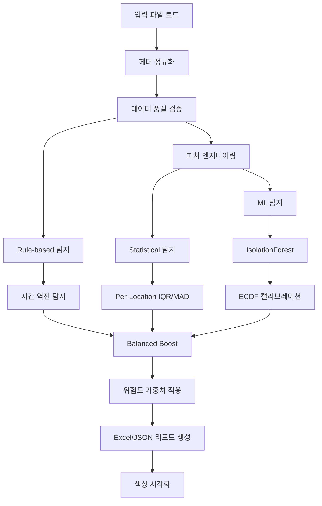

# Stage 4: 이상치 탐지 (Anomaly Detection) 기술 문서

## 개요

Stage 4는 Stage 3에서 생성된 종합 보고서를 분석하여 이상치를 탐지하는 단계입니다. Balanced Boost 시스템을 통해 Rule-based, Statistical, ML 기반 탐지를 3단 혼합하여 정확도를 향상시킵니다.

**버전**: v4.0 (Balanced Boost Edition)  
**핵심 스크립트**: `scripts/stage4_anomaly/anomaly_detector_balanced.py`

---

## 사용 파일 목록

### 입력 파일

- **Stage 3 보고서**: `data/processed/reports/HVDC_입고로직_종합리포트_*.xlsx`
  - "통합_원본데이터_Fixed" 시트 사용
  - 63개 표준 헤더 포함

### 출력 파일

- **Excel 보고서**: `data/anomaly/HVDC_anomaly_report.xlsx`
  - Summary 시트: 유형별/심각도별 집계
  - Anomalies 시트: 상세 이상치 목록
  - Features 시트: 피처 데이터
- **JSON 보고서**: `data/anomaly/HVDC_anomaly_report.json`
  - 구조화된 이상치 데이터

### 핵심 스크립트

- `scripts/stage4_anomaly/anomaly_detector_balanced.py` (734줄)
  - 메인 이상치 탐지 로직
  - Balanced Boost 시스템
- `scripts/stage4_anomaly/anomaly_visualizer.py`
  - Excel 색상 시각화
  - 이상치 유형별 색상 적용

### Core 모듈

- `scripts/core/header_registry.py`
  - 창고/현장 컬럼 정의
- `scripts/core/header_normalizer.py`
  - 헤더명 정규화

### 설정 파일

- `config/stage4_anomaly.yaml`
  - 입력/출력 경로
  - ML 모델 파라미터
  - 시각화 옵션

---

## 주요 알고리즘

### 1. Balanced Boost 시스템

**목적**: Rule-based, Statistical, ML 기반 탐지를 3단 혼합하여 정확도 향상

**3단 혼합 구조**:
1. **Rule-based 탐지**: 시간 역전, 데이터 품질 검증
2. **Statistical 탐지**: Per-Location IQR/MAD 기반 과도 체류 탐지
3. **ML 탐지**: IsolationForest 기반 이상치 탐지

**Balanced Boost 로직**:
- 규칙/통계 근거가 있을 때 ML 위험도를 가중(가산)
- 허위 양성은 낮추고 진짜 이상은 끌어올림

**가중치 설정**:
- `rule_boost`: 0.25 (시간 역전 발생 시 ML 위험도 가산)
- `stat_boost_high`: 0.15 (통계 이상 높음/치명적)
- `stat_boost_med`: 0.08 (통계 이상 보통)

**코드 구조**:
```python
def fuse(self, case_id: str, ml_risk: float) -> float:
    r = float(ml_risk)
    if case_id in self.rule_cases:
        r += self.cfg.rule_boost  # +0.25
    if case_id in self.stat_cases_high:
        r += self.cfg.stat_boost_high  # +0.15
    elif case_id in self.stat_cases_med:
        r += self.cfg.stat_boost_med  # +0.08
    return float(np.clip(r, 0.001, 0.999))
```

### 2. ECDF 캘리브레이션

**목적**: 위험도 점수를 0.001~0.999 범위로 정규화하여 포화 방지

**ECDF (Empirical Cumulative Distribution Function)**:
- 순위 기반 위험도 계산
- 베타-스무딩으로 0과 1 포화 방지

**베타-스무딩 공식**:
```
p = (rank + 1.0) / (n + 2.0)
p = clip(p, 0.001, 0.999)
```

**코드 구조**:
```python
class ECDFCalibrator:
    def fit(self, raw: np.ndarray):
        r = rankdata(raw, method="average")  # 순위 계산
        p = (r + 1.0) / (self.n + 2.0)  # 베타-스무딩
        self.order = p
        return self
    
    def transform(self, raw: np.ndarray):
        p = np.asarray(self.order, dtype=float)
        p = np.clip(p, 0.001, 0.999)  # 포화 방지
        return p
```

### 3. Per-Location IQR/MAD

**목적**: 위치별 정상 체류 분포를 학습하여 과도 체류 탐지

**IQR (Interquartile Range)**:
- Q1, Q3 계산
- IQR = Q3 - Q1
- 임계값: Q3 + k × IQR (k=1.5)

**MAD (Median Absolute Deviation)**:
- 중앙값 기준 편차 계산
- 임계값: median + k × MAD (k=3.5)

**Per-Location 학습**:
- 각 창고/현장별로 독립적으로 정상 분포 학습
- 최소 표본 수: 10건 (min_group_size)

**현재 상태**: 사용자 요구사항에 따라 상태 체류 탐지 비활성화
- "상태 체류는 상관이 없다. 정상이라는 의미는 무효하다"

### 4. IsolationForest ML 탐지

**목적**: 다차원 피처 공간에서 이상치 자동 탐지

**피처 구성**:
- TOUCH_COUNT: 접촉 지점 개수
- TOTAL_DAYS: 총 체류 일수
- AMOUNT: 금액
- QTY: 수량
- PKG: 패키지 수

**모델 선택**:
1. **PyOD IForest** (우선): `pyod.models.iforest.IForest`
   - decision_scores_ 사용 (값이 클수록 이상치)
2. **Sklearn IsolationForest** (폴백): `sklearn.ensemble.IsolationForest`
   - decision_function 사용 (+: 정상, -: 이상)
   - 위험도 = 1 - ECDF(dec)

**파라미터**:
- `contamination`: 0.02 (2% 가정)
- `random_state`: 42
- `n_estimators`: 256 (sklearn)

**코드 구조**:
```python
def fit_predict(self, X: pd.DataFrame):
    # 표준화
    Xs = StandardScaler().fit_transform(X.values)
    
    # PyOD 우선, sklearn 폴백
    if self.use_pyod_first:
        model = PyODIForest(contamination=0.02)
        model.fit(Xs)
        raw = model.decision_scores_
        risk = ECDFCalibrator().fit(raw).transform(raw)
    else:
        model = IsolationForest(contamination=0.02)
        model.fit(Xs)
        dec = model.decision_function(Xs)
        risk = 1.0 - ECDFCalibrator().fit(dec).transform(dec)
    
    y = (risk >= (1 - contamination)).astype(int)
    return y, risk
```

### 5. 시간 역전 탐지

**목적**: 날짜 컬럼의 논리적 순서 검증

**탐지 규칙**:
1. ETD > 창고 입고일
2. ETA > 창고 입고일
3. ETD > 현장 입고일
4. ETA > 현장 입고일

**심각도**: CRITICAL (치명적)
**위험도**: 0.999 (고정)

**코드 구조**:
```python
def time_reversal(self, row: pd.Series):
    etd = pd.to_datetime(row.get("ETD"), errors="coerce")
    eta = pd.to_datetime(row.get("ETA"), errors="coerce")
    warehouse_date = get_warehouse_date(row)
    site_date = get_site_date(row)
    
    if etd and warehouse_date and etd > warehouse_date:
        return AnomalyRecord(
            anomaly_type=AnomalyType.TIME_REVERSAL,
            severity=AnomalySeverity.CRITICAL,
            risk_score=0.999,
            ...
        )
```

### 6. 데이터 품질 검증

**목적**: 기본적인 데이터 정합성 검증

**검증 항목**:
1. **필수 필드 누락**: CASE_NO 컬럼 존재 확인
2. **CASE_NO 중복**: 중복 레코드 탐지
3. **HVDC_CODE 패턴**: `^HVDC-ADOPT-\d{3}-\d{4}$` 정규식 매칭
4. **날짜 변환 실패**: 창고/현장 컬럼의 날짜 변환 가능성 확인

**심각도**: MEDIUM (보통)

### 7. 색상 시각화

**목적**: Excel 출력에서 이상치를 시각적으로 표시

**색상 규칙**:
- **빨간색**: CRITICAL 이상치
- **주황색**: HIGH 이상치
- **노란색**: MEDIUM 이상치
- **연두색**: LOW 이상치

**적용 방식**:
- 이상치가 있는 행 전체에 색상 적용
- 이상치 유형별로 다른 색상 사용

---

## 데이터 흐름



### 상세 단계

#### Step 1: 데이터 로드 및 정규화
1. Stage 3 보고서 로드
2. 헤더명 정규화 (HeaderNormalizer)
3. 컬럼명 표준화 (대문자, 언더스코어)

#### Step 2: 데이터 품질 검증
1. 필수 필드 확인
2. 중복 레코드 탐지
3. 패턴 매칭 검증
4. 날짜 변환 가능성 확인

#### Step 3: Rule-based 탐지
1. 시간 역전 탐지 (ETD/ETA vs 입고일)
2. 데이터 품질 이슈 기록

#### Step 4: 피처 엔지니어링
1. TOUCH_COUNT: 접촉 지점 개수
2. TOTAL_DAYS: 총 체류 일수
3. AMOUNT, QTY, PKG: 수량 정보
4. Dwell 리스트: 위치별 체류 일수

#### Step 5: Statistical 탐지
1. Per-Location IQR/MAD 계산
2. 과도 체류 탐지 (현재 비활성화)

#### Step 6: ML 탐지
1. 피처 표준화
2. IsolationForest 학습 및 예측
3. ECDF 캘리브레이션으로 위험도 정규화

#### Step 7: Balanced Boost
1. Rule-based 신호 수집
2. Statistical 신호 수집
3. ML 위험도에 가중치 적용
4. 최종 위험도 계산 (0.001~0.999)

#### Step 8: 리포트 생성
1. Excel 리포트 생성 (Summary, Anomalies, Features)
2. JSON 리포트 생성
3. 색상 시각화 적용 (선택)

---

## 핵심 클래스/함수

### HybridAnomalyDetector

**메인 이상치 탐지 클래스**

**주요 메서드**:

#### `run(df_raw, export_excel, export_json) -> Dict`
- 전체 이상치 탐지 프로세스 실행
- Rule → Statistical → ML → Balanced Boost 순차 실행
- 반환: summary, count, anomalies

**처리 순서**:
1. 헤더 정규화
2. 데이터 품질 검증
3. Rule-based 탐지
4. 피처 엔지니어링
5. Statistical 탐지
6. ML 탐지
7. Balanced Boost 적용
8. 리포트 생성

### RuleDetector

**규칙 기반 탐지 클래스**

**주요 메서드**:

#### `time_reversal(row) -> Optional[AnomalyRecord]`
- 시간 역전 탐지
- ETD/ETA vs 입고일 비교
- 반환: AnomalyRecord 또는 None

### StatDetector

**통계 기반 탐지 클래스**

**주요 메서드**:

#### `per_location_outliers(dwell_list) -> List[AnomalyRecord]`
- Per-Location IQR/MAD 기반 과도 체류 탐지
- 현재 비활성화 (사용자 요구사항)

### MLDetector

**ML 기반 탐지 클래스**

**주요 메서드**:

#### `fit_predict(X) -> Tuple[np.ndarray, np.ndarray]`
- IsolationForest 학습 및 예측
- PyOD 우선, sklearn 폴백
- 반환: (y_pred, risk_scores)

### ECDFCalibrator

**ECDF 캘리브레이션 클래스**

**주요 메서드**:

#### `fit(raw) -> ECDFCalibrator`
- 순위 기반 ECDF 학습
- 베타-스무딩 적용

#### `transform(raw) -> np.ndarray`
- 위험도 정규화 (0.001~0.999)
- 포화 방지

### BalancedCombiner

**Balanced Boost 결합 클래스**

**주요 메서드**:

#### `fuse(case_id, ml_risk) -> float`
- ML 위험도에 가중치 적용
- Rule/Statistical 신호 기반 가산
- 반환: 최종 위험도 (0.001~0.999)

### FeatureBuilder

**피처 엔지니어링 클래스**

**주요 메서드**:

#### `build(df) -> Tuple[DataFrame, List]`
- 피처 데이터 생성
- Dwell 리스트 생성
- 반환: (features_df, dwell_list)

---

## 설정 파일 구조

### stage4_anomaly.yaml

```yaml
stage4:
  io:
    input_file: reports/HVDC_입고로직_종합리포트_latest.xlsx
    sheet_name: 통합_원본데이터_Fixed
    excel_output: reports/anomalies/anomaly_list.xlsx
    json_output: reports/anomalies/anomaly_list.json
  visualization:
    enable_by_default: false
    case_column: Case No.
    backup_enabled: true
  model:
    contamination: 0.02  # 2% 가정
    random_state: 42
    use_pyod_first: true
  detector:
    iqr_k: 1.5
    mad_k: 3.5
    min_group_size: 10
    rule_boost: 0.25
    stat_boost_high: 0.15
    stat_boost_med: 0.08
    min_risk_to_alert: 0.9
```

---

## 성능 지표

### 실행 시간 (8,930행 기준, 2025-12-21 실행 결과)
- 데이터 로드 및 정규화: ~3초
- 데이터 품질 검증: ~2초
- Rule-based 탐지: ~5초
- 피처 엔지니어링: ~8초
- Statistical 탐지: ~3초
- ML 탐지: ~25초
- Balanced Boost: ~2초
- 리포트 생성: ~10초
- **총 실행 시간**: ~58.24초 (약 1분)

### 처리 통계 (실제 실행 결과 - 2025-12-21)
- 입력 행수: 8,930행
- ML 이상치 탐지: 181건
- 데이터 품질 이슈: 1건 (CASE_NO 중복)
- 총 이상치: 182건 (2.0% 탐지율)
- 이상치 유형별 분포:
  - 데이터 품질: 1건 (CRITICAL)
  - ML 이상치: 181건 (MEDIUM)
- 심각도별 분포:
  - CRITICAL: 1건
  - MEDIUM: 181건

---

## 주요 개선사항 (v4.0)

### Balanced Boost 시스템
- Rule + Statistical + ML 3단 혼합
- 가중치 기반 위험도 조정
- 허위 양성 감소, 진짜 이상 강조

### ECDF 캘리브레이션
- 순위 기반 위험도 정규화
- 베타-스무딩으로 포화 방지
- 0.001~0.999 범위 보장

### Per-Location IQR/MAD
- 위치별 정상 분포 학습
- 과도 체류 탐지 (현재 비활성화)

### IsolationForest ML
- PyOD 우선, sklearn 폴백
- 다차원 피처 공간 이상치 탐지
- ECDF 캘리브레이션 적용

### 색상 시각화
- 이상치 유형별 색상 적용
- Excel 출력에서 시각적 표시

---

## 확장성 및 유지보수성

### 새 이상치 유형 추가
1. `AnomalyType` Enum에 추가
2. `RuleDetector` 또는 `StatDetector`에 탐지 로직 추가
3. `BalancedCombiner`에 가중치 로직 추가

### 새 ML 모델 추가
1. `MLDetector` 클래스에 모델 선택 로직 추가
2. `fit_predict()` 메서드 수정

### 새 피처 추가
1. `FeatureBuilder` 클래스에 피처 계산 로직 추가
2. `build()` 메서드 수정

---

## 참고 문서

- [Core Module 통합 가이드](../scripts/core/INTEGRATION_GUIDE.md)
- [Header Registry 문서](../scripts/core/README.md)
- [Balanced Boost 알고리즘 상세](../scripts/stage4_anomaly/anomaly_detector_balanced.py)

