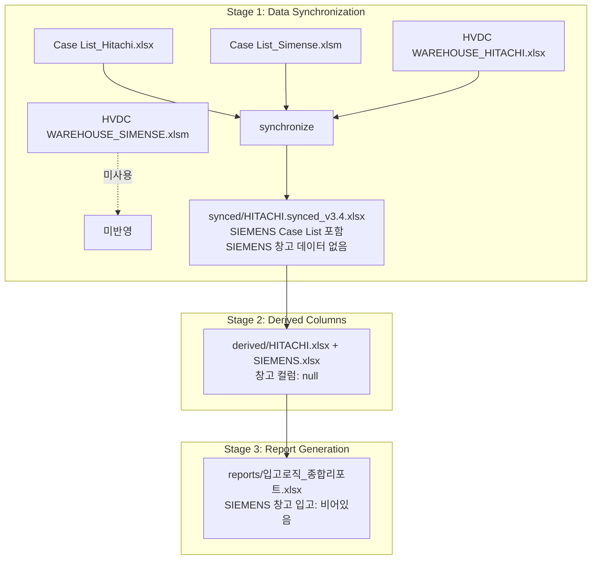
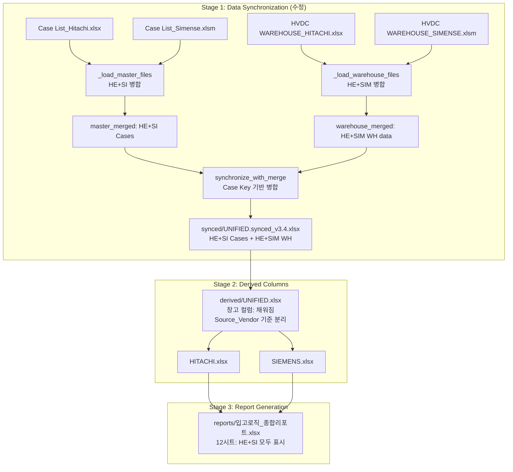
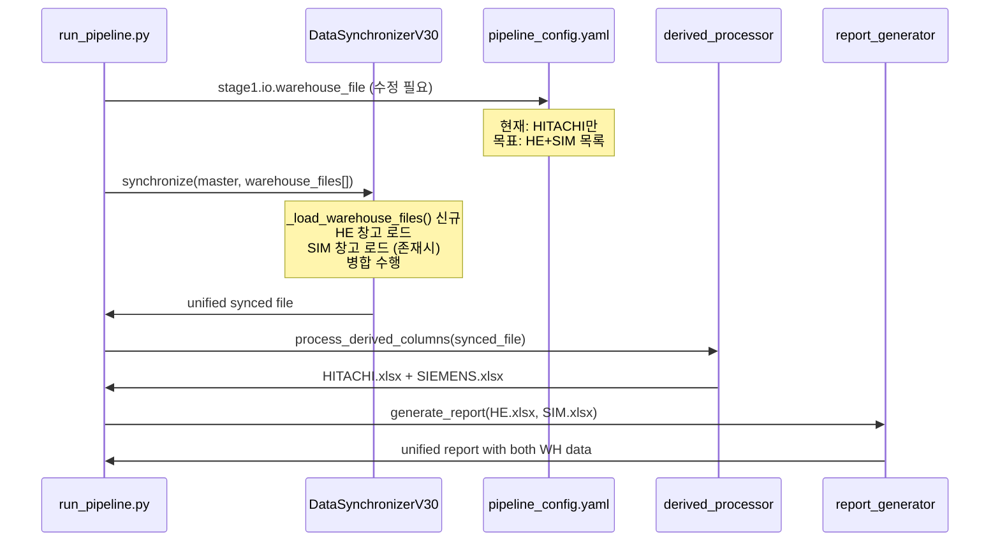

# SIEMENS 창고 입고 동기화 구현 계획

**승인 일시**: 2026-04-15  
**계획 버전**: v1.1  
**추천 옵션**: B (통합 동기화)

---

## 검색 결과 반영 (2026-04-15)

### 로컬 코드베이스 분석 결과

**핵심 발견**: "Package No" → "Case No." 매핑은 이미 4곳에서 정의되어 있음:

1. **scripts/core/header_registry.py** (line 143-149)
   - `case_number` semantic key의 aliases에 "Package No", "PackageNo", "Package_No" 포함

2. **core/core/name_resolver.py** (line 123-128)
   - HEADER_ALIASES에 동일한 매핑 정의

3. **scripts/stage1_sync_sorted/data_synchronizer_v30.py** (Master 처리, line 837-842)
   - `column_mapping = {"PackageNo": "Case No.", ...}`

4. **scripts/stage1_sync_sorted/data_synchronizer_v30.py** (Warehouse 처리, line 1070-1074)
   - `siemens_wh_mapping = {"Package No": "Case No.", "PackageNo": "Case No.", ...}`

**문제 재정의**: 매핑 정의는 존재하지만, **`_load_warehouse_files` 실행 경로에서 매핑이 적용되지 않는 경로 분석 필요**

### 외부 인터넷 검색 결과 (pandas 다중 벤더 병합)

**Best Practice - Different Column Names**:
```python
# left_on/right_on 사용하여 다른 컬럼명 병합
pd.merge(df_hitachi, df_siemens, 
         left_on="Case No.", 
         right_on="Package No",  # SIEMENS 원본 컬럼명 사용
         how="outer")
```

**Best Practice - Multiple DataFrames**:
```python
import functools
merged = functools.reduce(
    lambda left, right: pd.merge(left, right, on="Case No.", how="outer"),
    vendor_dfs
)
```

### 수정된 접근 방식

**원래 계획**: 컬럼명 매핑 후 병합  
**수정된 계획**: 
1. 매핑 정의가 이미 존재하므로, 실행 경로 디버깅에 집중
2. pandas `left_on/right_on`을 사용하여 매핑 없이 직접 병합
3. `_merge_warehouse_data` 메서드에서 Case Key 매칭 로직 개선

---

## Phase 2: Engineering Review

### 2.1 Mermaid 다이어그램

#### 현재 데이터 흐름 (문제 상태)


#### 목표 데이터 흐름 (수정 후)


#### 파일 처리 순서 (Sequence Diagram)


### 2.2 파일 변경 목록

| 파일 | 변경 유형 | 설명 | 상세 내용 |
|------|----------|------|-----------|
| `config/pipeline_config.yaml` | modify | Stage 1 IO 설정 변경 | `warehouse_file`을 단일 파일 → 파일 목록/패턴으로 변경, 또는 `warehouse_files` 신규 키 추가 |
| `scripts/stage1_sync_sorted/data_synchronizer_v30.py` | modify | 핵심 동기화 로직 확장 | `synchronize()` 메서드 수정, `_load_warehouse_files()` 신규 메서드 추가, `_load_file_by_sheets()` 확장 |
| `scripts/stage1_sync_sorted/data_synchronizer_v30.py` | modify | 병합 로직 추가 | HE 창고와 SIM 창고를 Case Key 기준으로 병합하는 `_merge_warehouse_data()` 추가 |
| `scripts/stage2_derived/derived_columns_processor.py` | modify | 입력 파일 경로 확인 | `resolve_synced_input_path()`에서 unified synced 파일 경로 처리 확인 |
| `config/stage2_derived_config.yaml` | modify | 입력 파일 경로 업데이트 | `synced_file` 경로가 unified 출력을 가리키도록 수정 (필요시) |
| `tests/test_stage1_siemens_warehouse.py` | create | 회귀 테스트 | SIEMENS 창고 병합 시나리오 테스트 |
| `scripts/utils/verify_siemens_warehouse.py` | create | 검증 스크립트 | SIEMENS 창고 컬럼 null 비율 집계 및 보고 |

**파일명 충돌 확인**: `test_stage1_siemens_warehouse.py`는 기존 테스트와 충돌 없음. `verify_siemens_warehouse.py`는 신규 유틸리티.

### 2.3 의존성 & 순서

```
┌─────────────────────────────────────────────────────────────────┐
│                        작업 의존성 그래프                        │
└─────────────────────────────────────────────────────────────────┘

[1] 설정 분석 및 백업
    │
    ├──> [2] config/pipeline_config.yaml 수정
    │         │
    │         └──> [3] data_synchronizer_v30.py 구현
    │                   │
    │                   ├──> [3.1] _load_warehouse_files() 개발
    │                   │         │
    │                   │         └──> [3.2] _merge_warehouse_data() 개발
    │                   │                   │
    │                   │                   └──> [3.3] synchronize() 통합
    │                   │                             │
    │                   │                             └──> [4] 단위 테스트
    │                   │                                       │
    │                   │                                       └──> [5] 통합 테스트
    │                   │                                                 │
    │                   │                                                 └──> [6] 검증 및 리포트
    │                   │
    │                   └──> (병렬 가능) [7] 검증 스크립트 개발
    │
    └──> (사전) [0] data/raw 파일 존재 확인
```

#### 선행 작업 (Prerequisites)
1. **파일 존재 확인**: `data/raw/HVDC WAREHOUSE_SIMENSE(SIM).xlsm` 확인
2. **백업 생성**: `pipeline_config.yaml`, `data_synchronizer_v30.py` 백업
3. **헤더 분석**: SIM 창고 파일의 헤더 구조 확인 (row_index, 컬럼명)

#### 병렬 작업 가능
- `[7] 검증 스크립트 개발`은 `[3]`과 병렬 진행 가능 (독립적)

### 2.4 테스트 전략

#### 단위 테스트 (신규: `tests/test_stage1_siemens_warehouse.py`)

```python
# 핵심 테스트 케이스
def test_load_warehouse_files_finds_both_vendors()
def test_merge_warehouse_data_preserves_all_rows()
def test_merge_warehouse_data_case_key_matching()
def test_siemens_warehouse_columns_in_output()
def test_source_vendor_set_correctly_for_warehouse()
```

| 테스트 | 목적 | 검증 방법 |
|--------|------|-----------|
| `test_load_warehouse_files_finds_both_vendors` | HE+SIM 창고 파일 모두 로드 | 파일 존재 확인, DataFrame 생성 확인 |
| `test_merge_warehouse_data_preserves_all_rows` | 병합 시 행수 보존 | input 행수 합 = output 행수 검증 |
| `test_merge_warehouse_data_case_key_matching` | Case No. 기준 병합 정확성 | 동일 Case의 창고 일자가 통합되었는지 확인 |
| `test_siemens_warehouse_columns_in_output` | SIM 창고 컬럼 존재 확인 | DHL Warehouse, DSV Indoor 등 null 비율 < 100% |
| `test_source_vendor_set_correctly_for_warehouse` | 메타데이터 설정 | Source_Vendor = SIEMENS 설정 확인 |

#### 통합 테스트

```bash
# 실행 시퀀스
1. python run/run_pipeline.py --stage 1
   └─> 출력: data/processed/synced/UNIFIED.synced_v3.4.xlsx 확인
   
2. python scripts/utils/verify_siemens_warehouse.py
   └─> SIEMENS 창고 컬럼 null 비율 < 100% 확인
   
3. python run/run_pipeline.py --stage 2
   └─> SIEMENS 분리 파일에 창고 데이터 존재 확인
   
4. python run/run_pipeline.py --stage 3
   └─> 12시트 보고서에서 SIEMENS 창고 입출고 표시 확인
```

#### 기존 테스트 영향 분석

| 기존 테스트 | 영향 가능성 | 대응 |
|-------------|------------|------|
| `test_data_synchronizer.py` | 높음 | unified 출력 경로로 업데이트 |
| `test_header_detection.py` | 중간 | SIM 창고 헤더(row 0) 테스트 추가 |
| `test_derived_columns.py` | 낮음 | 입력 파일 경로만 업데이트 |
| `test_report_generator.py` | 낮음 | HE+SIM 모두 로드되도록 설정 |

### 2.5 리스크 & 완화

| 리스크 | 심각도 | 완화 전략 | 검증 방법 |
|--------|--------|-----------|-----------|
| **Stage 1 핵심 로직 변경으로 인한 HE 데이터 처리 회귀** | 높음 | 1) 백업 유지<br>2) 플래그 기반 분기 ( unified vs legacy )<br>3) 단계적 롤아웃 | 기존 HE-only 파이프라인과 출력 비교 (행수, 컬럼값) |
| **Case Key 불일치 (HE vs SI)** | 중간 | PackageNo → Case No. 매핑 확인<br>대소문자/공백 정규화 | 매핑 실패 Case 수 집계 (target: 0) |
| **헤더 행 위치 차이 (HE: row 4, SI: row 0)** | 중간 | `_detect_vendor_and_header_row()` 재사용<br>시트별 헤더 위치 개별 처리 | 각 시트 헤더 row_index 로깅 및 검증 |
| **동일 Case의 창고 데이터 충돌** | 낮음 | HE 창고 데이터 우선 (current behavior)<br>또는 merge 전략 선택 가능 | 충돌 Case 수 로깅, 수동 검증 |
| **성능 저하 (파일 2개 로드)** | 낮음 | lazy loading, 캐싱<br>병렬 처리 (future) | Stage 1 실행 시간 측정 (baseline vs 수정) |
| **설정 호환성 깨짐** | 중간 | `warehouse_file` 단일 파일도 여전히 지원<br>새로운 `warehouse_files` 키 추가 | 기존 설정으로 실행 시 동일 결과 검증 |

#### ZERO/AMBER Gate 적용

| Gate | 조건 | 적용 내용 |
|------|------|-----------|
| **ZERO** | HE 동기화 결과가 현재와 다름 | 기존 동기화 로직 100% 보존, unified는 추가 옵션으로 제공 |
| **AMBER** | SIM 창고 파일이 없는 경우 | 경고 로그 출력, HE-only로 fallback, 파이프라인 계속 진행 |
| **AMBER** | Case Key 매핑 실패율 > 5% | 경고 로그, 매핑 실패 Case 목록 출력, 수동 검증 필요 |

### 2.6 세부 구현 설계

#### 2.6.1 `pipeline_config.yaml` 변경안

```yaml
stages:
  stage1:
    io:
      # 기존 단일 파일 (하위호환)
      warehouse_file: data/raw/HVDC WAREHOUSE_HITACHI(HE).xlsx
      
      # 신규: 다중 창고 파일 지원 (옵션 B)
      warehouse_files:
        - vendor: HITACHI
          path: data/raw/HVDC WAREHOUSE_HITACHI(HE).xlsx
          required: true
        - vendor: SIEMENS
          path: data/raw/HVDC WAREHOUSE_SIMENSE(SIM).xlsm
          required: false  # 없으면 HE-only로 진행
      
      # 출력: unified 파일명
      output_file: data/processed/synced/HVDC WAREHOUSE_UNIFIED.synced_v3.4.xlsx
```

#### 2.6.2 `data_synchronizer_v30.py` 메서드 추가

```python
def _load_warehouse_files(
    self, 
    warehouse_configs: List[Dict[str, Any]]
) -> Dict[str, pd.DataFrame]:
    """
    다중 창고 파일 로드 및 병합.
    
    Args:
        warehouse_configs: [{vendor, path, required}, ...]
    
    Returns:
        {sheet_name: merged_df} 형태의 딕셔너리
        
    Note:
        - 각 파일의 시트를 vendor별로 로드
        - 동일 시트명을 가진 경우 Case Key 기준으로 병합
        - Source_Vendor_Warehouse 컬럼 추가 (창고 출처 표시)
    """
    pass

def _merge_warehouse_data(
    self,
    warehouse_sheets_list: List[Dict[str, pd.DataFrame]],
    vendor_hints: List[str]
) -> Dict[str, pd.DataFrame]:
    """
    여러 창고 파일의 시트를 병합.
    
    병합 전략:
    1. 시트명 기준 그룹화
    2. 동일 시트 내 Case Key 기준 outer join
    3. HE 데이터 우선, SI 데이터는 HE에 없는 Case만 추가
    """
    pass
```

#### 2.6.3 병합 전략 상세

| 시나리오 | 처리 방법 | 결과 Source_Vendor |
|----------|-----------|-------------------|
| Case가 HE 창고에만 존재 | HE 데이터 사용 | HITACHI |
| Case가 SI 창고에만 존재 | SI 데이터 사용 | SIEMENS |
| Case가 둘 다 존재 (동일 시트) | HE 데이터 우선, SI 창고 일자는 별도 컬럼에 저장 | HITACHI (창고 출처: HE+SI) |
| Case가 둘 다 존재 (다른 시트) | 시트명 기준 개별 병합 | 해당 시트의 vendor |

### 2.7 검증 및 완료 기준

#### DoD (Definition of Done)

- [ ] `pipeline_config.yaml`에 `warehouse_files` 설정 추가
- [ ] `data_synchronizer_v30.py`에 `_load_warehouse_files()` 구현
- [ ] `data_synchronizer_v30.py`에 `_merge_warehouse_data()` 구현
- [ ] unified synced 파일에 SIEMENS 창고 컬럼 데이터 포함 확인
- [ ] Stage 2 출력(SIEMENS.xlsx)에서 창고 컬럼 null 비율 < 50%
- [ ] Stage 3 12시트 보고서에 SIEMENS 창고 입출고 데이터 표시
- [ ] 기존 HE-only 파이프라인과 동일 결과 검증 (회귀 테스트 통과)
- [ ] `tests/test_stage1_siemens_warehouse.py` 모든 케이스 통과
- [ ] 문서 업데이트: `docs/common/STAGE_BY_STAGE_GUIDE.md`

---

## 다음 단계

1. **Phase 2 리뷰**: 위 계획 검토 및 피드백
2. **Phase 2 승인** 후 구현 시작
3. **실행 순서**:
   - Step 1: 백업 및 파일 존재 확인
   - Step 2: 설정 파일 수정
   - Step 3: 동기화 로직 구현
   - Step 4: 테스트 및 검증
   - Step 5: 문서 업데이트

**질문/우려사항이 있으시면 말씀해 주세요.**
